---
## Front matter
lang: ru-RU
title: Лабораторная работа №1
subtitle: Установка и конфигурация операционной системы на виртуальную машину
author:
  - Шурыгин Илья
institute:
  - Российский университет дружбы народов, Москва, Россия
date: 17 февраля 2023

## i18n babel
babel-lang: russian
babel-otherlangs: english

## Formatting pdf
toc: false
toc-title: Содержание
slide_level: 2
aspectratio: 169
section-titles: true
theme: metropolis
header-includes:
 - \metroset{progressbar=frametitle,sectionpage=progressbar,numbering=fraction}
 - '\makeatletter'
 - '\beamer@ignorenonframefalse'
 - '\makeatother'
---

# Информация

## Докладчик

:::::::::::::: {.columns align=center}
::: {.column width="70%"}

  * Шурыгин Илья Максимович
  * студент-первокурсник
  * Российский университет дружбы народов
  * <https://github.com/IlyShaSh>

:::
::::::::::::::

# Вводная часть

## Актуальность

- Установка операционной системы Linux на виртуальную машину позволяет получить базовые навыки взаимодействия с операционной системой.

## Цели и задачи

Целью моей работы является приобретение практических навыков установки операционной системы на виртуальную машину, настройки минимально необходимых для дальнейшей работы сервисов.

# Ход работы

## Создание виртуальной машины

Запускаем терминал и переходим в каталог /var/tmp. Создаем каталог с нашим именем или проверяем его наличие с помощью команды ls. Запускаем виртуальную машину VirtualBox &. Также меняем комбинацию для хост-клавиши, которая используется для освобождения курсора мыши, который может захватить виртуальная машина.

##

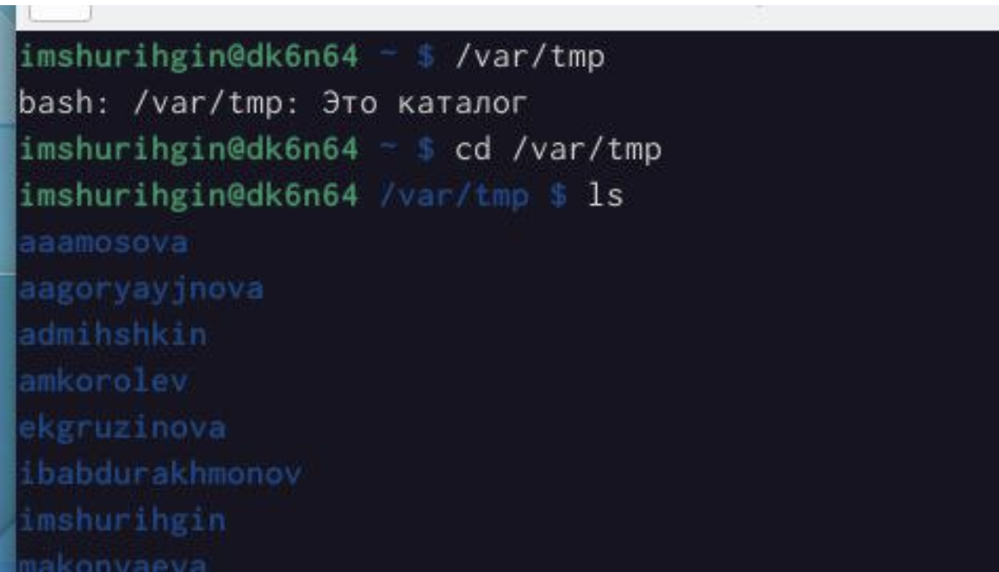{ #fig:001 width=70% }

##

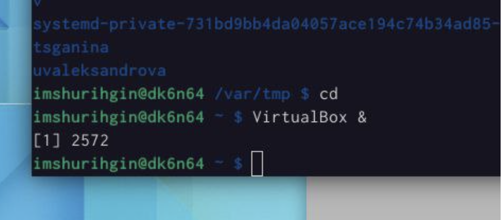{ #fig:002 width=70% }

##

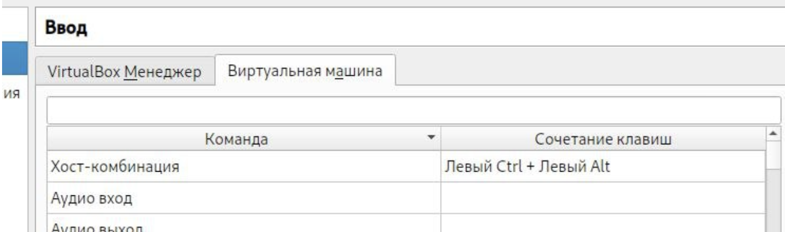{ #fig:003 width=70% }

##

Создаем папку для виртуальной машины. Затем, выбираем все необходимые параметры: тип операционной системы — Linux, Fedora, размер основной памяти виртуальной машины — от 2048 МБ, конфигурацию жёсткого диска — загрузочный, VDI, динамический виртуальный диск, размер диска — 82 ГБ. Его расположение: /var/tmp/имя_пользователя/fedora.vdi. Доступный объем видеопамяти увеличиваем до 128 МБ. В настройках виртуальной машины во вкладке Носители добавляем новый привод оптических дисков.

##

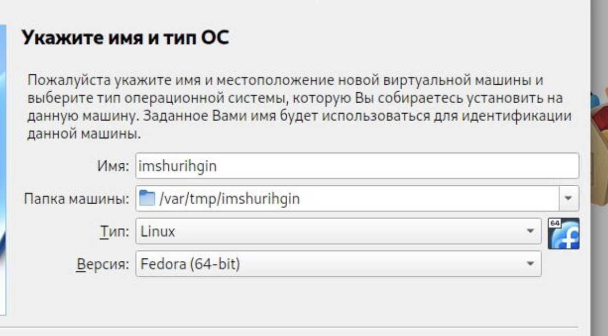{ #fig:004 width=70% }

##

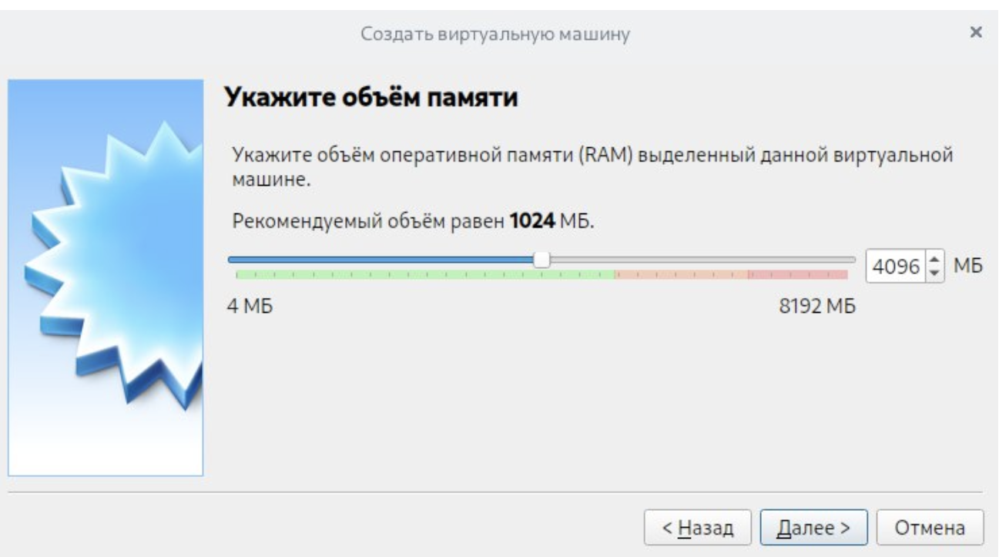{ #fig:005 width=70% }

##

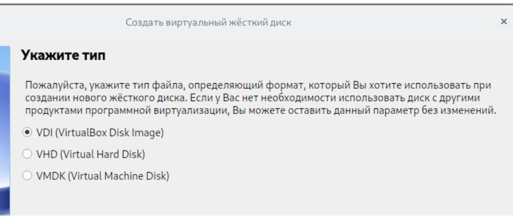{ #fig:006 width=70% }

##

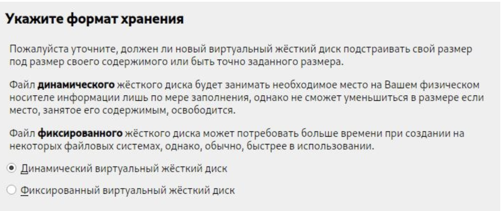{ #fig:013 width=70% }

##

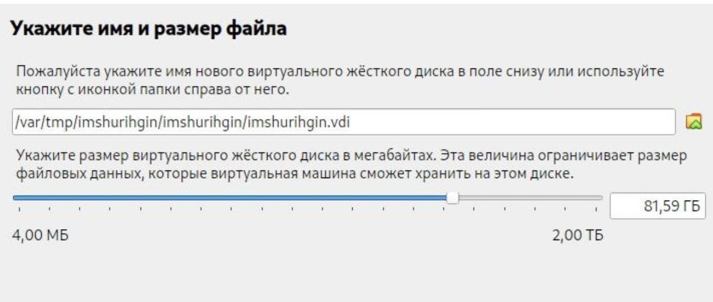{ #fig:007 width=70% }

##

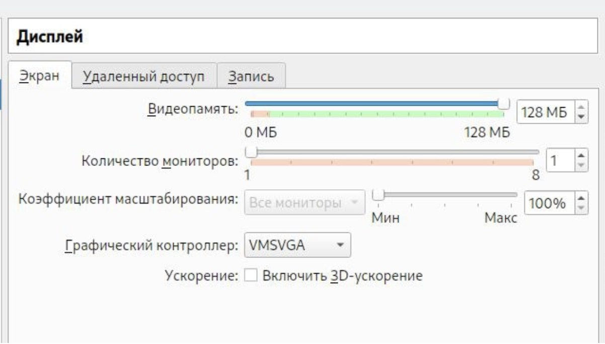{ #fig:008 width=70% }

##

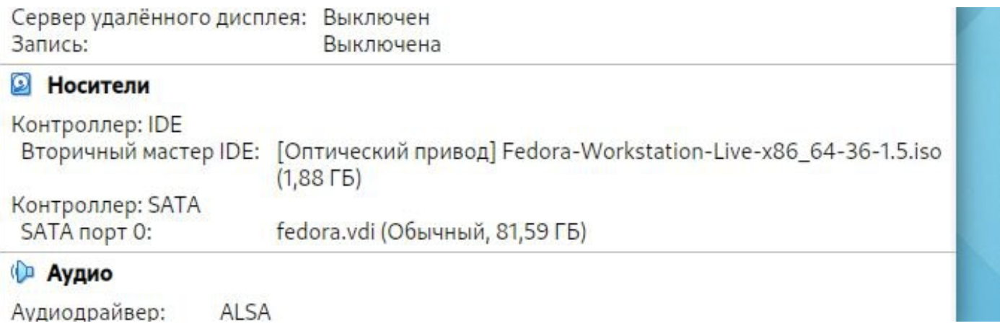{ #fig:009 width=70% }

## 

Запускаем виртуальную машину. Затем, устанавливаем систему на жестких диск - Install to Hard Drive. При необходимости корректируем часовой пояс, раскладку клавиатуры.

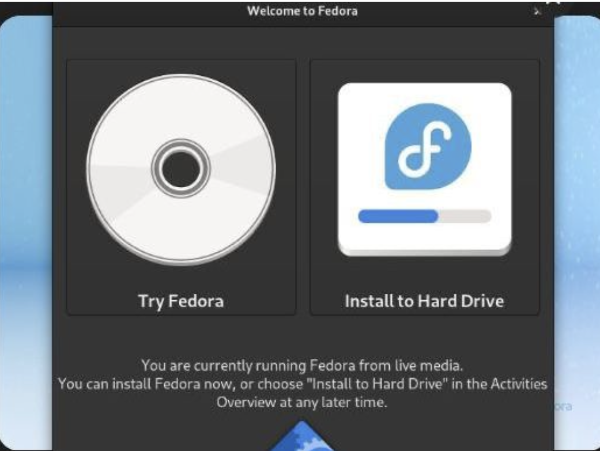{ #fig:010 width=50% }

##

После подготовительных действий нажимаем: начать установку. При установке: задаем пароль для пользователя root (суперпользователь администратор) и создаем обычного пользователя с вашим логином. После окончания установки, следует закрыть окно установщика и выключить систему. После того, как виртуальная машина отключится, следует изъять образ диска из дисковода, при этом сам дисковод удалять не следует!

##

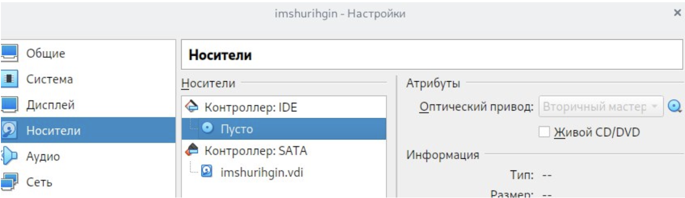{ #fig:011 width=70% }

## Домашнее задание:

Дождался загрузки графического окружения и открыла терминал. В окне терминала проанализировал последовательность загрузки системы, выполнив команду dmesg. Получим версию ядра Linux (Linux version).

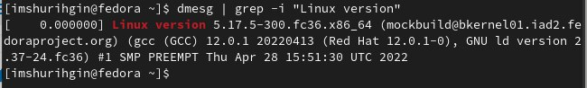{ #fig:014 width=70% }

##

Получим частоту процессора (Detected Mhz processor).

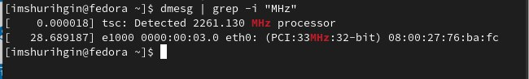{ #fig:015 width=70% }

##

Получим модель процессора (CPU0).

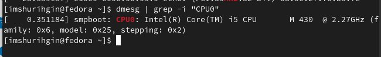{ #fig:016 width=40% }

Получим объем доступной оперативной памяти (Memory available).

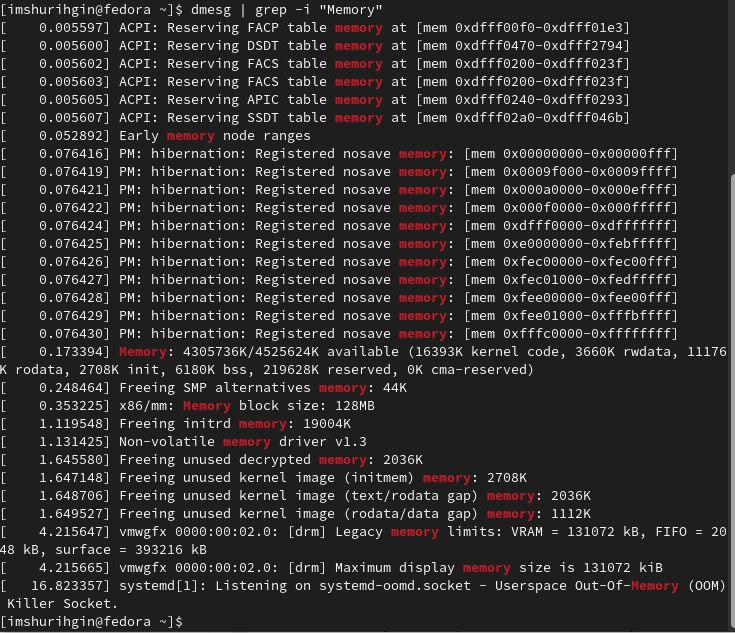{ #fig:017 width=40% }

##

Получим тип обнаруженного гипервизора (Hypervisor detected) и тип файловой системы корневого раздела. Последовательность монтирования файловых систем.

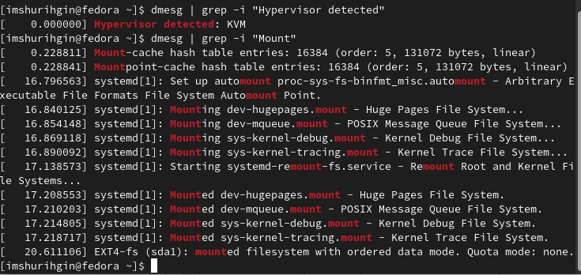{ #fig:018 width=70% }

## Контрольные вопросы:

1. Информация, которую содержит учётная запись пользователя:

- Имя пользователя (user name) - в рамках системы имя должно быть уникальным. В именах должны использоваться только английские буквы, числа и символы _ и . (точка)

##

- Идентификационный номер пользователя (UID) - является уникальным идентификатором пользователя в системе. Система отслеживает пользователей по UID, а не по именам.

##

- Идентификационный номер группы (GID) - обозначает группу, к которой относится пользователь. Каждый пользователь может принадлежать одной или нескольким группам. Принадлежность пользователя к группе устанавливает системный администратор, чтобы иметь возможность ограничивать доступ пользователей к тем или иным ресурсам системы.

##

- Пароль (password) - пароль пользователя в зашифрованном виде.

- Полное имя (full name) - помимо системного имени может присутствовать полное имя пользователя, например фамилия и имя.

- Домашний каталог (home directory) - каталог, в который попадает пользователь после входа в систему. Подобный каталог имеется у каждого пользователя, все пользовательские каталоги хранятся в директории /home.

##

- Начальная оболочка (login shell) - командная оболочка, которая будет запускаться при входе в систему. Например, /bin/bash.

##

2. Команды терминала:

- «команда> - help - для получения справки по команде
- cd - для перемещения по файловой системе
- Is - для просмотра содержимого каталога
- du <имя-директории» - для определения объёма каталога
- mkdir/irdir(rm -r) - для создания / удаления каталогов
- touch/rm - для создания / удаления файлов
- chmod - для задания определённых прав на файл / каталог
- history - для просмотра истории команд

##

3. Файловая система - порядок, определяющий способ организации, хранения и именования данных на носителях информации в компьютерах, а также в другом электронном оборудовании: цифровых фотоаппаратах, мобильных телефонах и т. п. Файловая система определяет формат содержимого и способ физического хранения информации, которую принято группировать в виде файлов. Конкретная файловая система определяет размер имен файлов и (каталогов), максимальный возможный размер файла и раздела, набор атрибутов файла.

##

4. df - утилита, показывающая список всех файловых систем по именам устройств, сообщает их размер, занятое и свободное пространство и точки монтирования. При выполнении без аргументов команда mount выведет все подключенные в данный момент файловые системы.

5. Удалить зависший процесс можно с помощью команды killall - killall «название зависшего процесса>

## Выводы

Вывод: я приобрел практические навыки по установке операционной системы Linux на виртуальную машину, запустил терминал и с его помощью установил pandoc, texlive.

# Результаты

## Заключение

Был получен навык установки и настройки операционной системы на виртуальную машину. Цель работы была достигнута.