---
## Front matter
lang: ru-RU
title: Лабораторная работа №4
subtitle: Взаимодействие с Unix на уровне командной строки
author:
  - Шурыгин Илья
institute:
  - Российский университет дружбы народов, Москва, Россия
date: 17 февраля 2023

## i18n babel
babel-lang: russian
babel-otherlangs: english

## Formatting pdf
toc: false
toc-title: Содержание
slide_level: 2
aspectratio: 169
section-titles: true
theme: metropolis
header-includes:
  - \metroset{progressbar=frametitle,sectionpage=progressbar,numbering=fraction}
  - '\makeatletter'
  - '\beamer@ignorenonframefalse'
  - '\makeatother'
---

# Информация

## Докладчик

:::::::::::::: {.columns align=center}
::: {.column width="70%"}

- Шурыгин Илья Максимович
- студент-первокурсник
- Российский университет дружбы народов
- <https://github.com/IlyShaSh>

:::
::::::::::::::

# Вводная часть

## Цели и задачи

Целью моей работы является: приобрести практические навыки взаимодействия пользователя с системой посредством командной строки.

# Ход работы

## Определим полное имя домашнего каталога. Далее прейдем в каталог /tmp и выведем на экран его содержимое

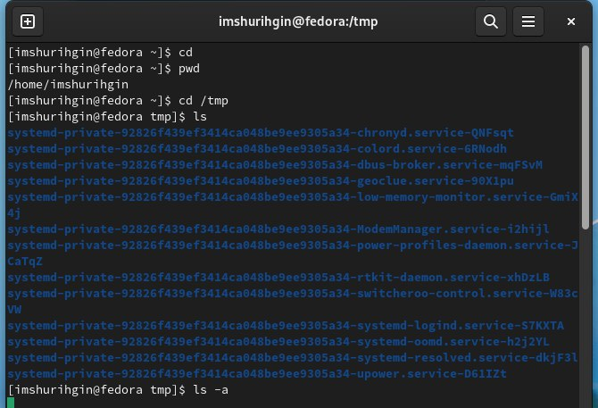{ #fig:001 width=70% }

##

Затем выведем имена скрытых файлов в /tmp, для этого необходимо использовать команду ls с опцией a.

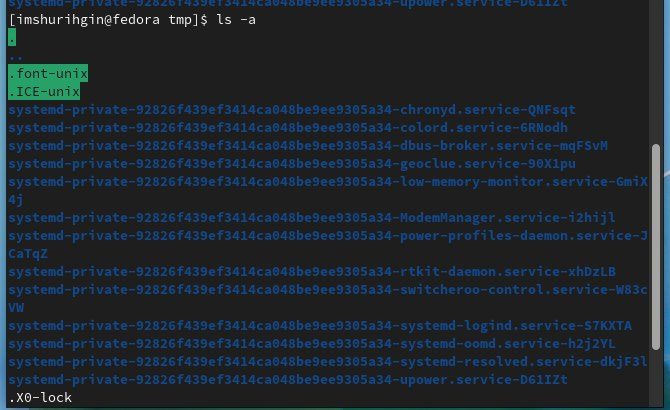{ #fig:002 width=70% }

##

Проверим, есть ли в каталоге /var/spool подкаталог с именем cron. Его там нет.

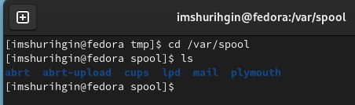{ #fig:003 width=70% }

## Перейдем в домашний каталог и выведем на экран его содержимое. Видно, что владельцем почти всех файлов являюсь я.

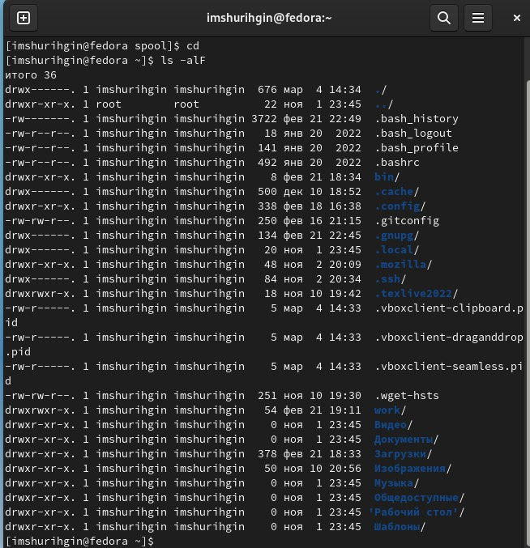{ #fig:004 width=70% }

## В домашнем каталоге создадим новый каталог с именем newdir. А затем в каталоге ~/newdir создадим новый каталог с именем morefun.

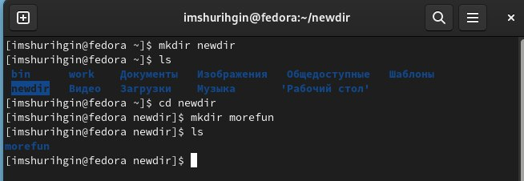{ #fig:005 width=70% }

##

В домашнем каталоге создадим одной командой три новых каталога с именами letters, memos, misk, а затем удалим эти каталоги также одной командой.

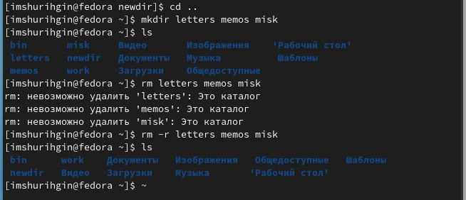{ #fig:006 width=50% }

## Удалим каталог ~/newdir/morefun из домашнего каталога.

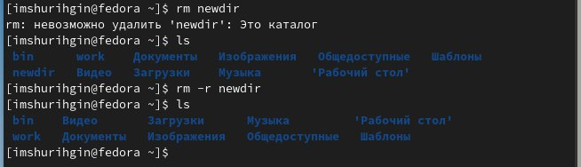{ #fig:007 width=70% }

## Для просмотра содержимого не только указанного каталога, но и подкаталогов, входящих в него нужно использовать опцию -R команды ls.

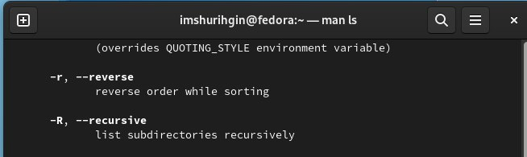{ #fig:008 width=70% }

## Опция -ltr команды ls позволяет отсортировать по времени последнего изменения выводимый список содержимого каталога с развёрнутым описанием файлов.

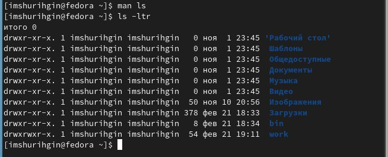{ #fig:009 width=60% }

## Основные опции этих команд cd, pwd, mkdir, rmdir и rm.

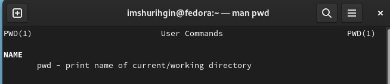{ #fig:010 width=30% }

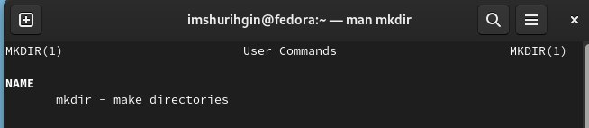{ #fig:011 width=30% }

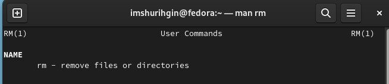{ #fig:012 width=30% }

## При помощи команды history выполним модификацию команды: man rmkdir на man ls.

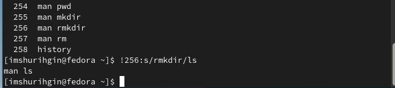{ #fig:013 width=70% }

# Контрольные вопросы:

## Что такое командная строка?

- Терминал для работы с файлами, каталогами.

## При помощи какой команды можно определить абсолютный путь текущего каталога?

- pwd

## При помощи какой команды и каких опций можно определить только тип файлов и их имена в текущем каталоге? Приведите примеры.

- ls -l

## Каким образом отобразить информацию о скрытых файлах? Приведите примеры.

- ls -a

## При помощи каких команд можно удалить файл и каталог? Можно ли это сделать одной и той же командой? Приведите примеры.

- rm/rmdir рм не удалит не пустой каталог.

## Каким образом можно вывести информацию о последних выполненных пользователем командах?

- history

## Как воспользоваться историей команд для их модифицированного выполнения? Приведите примеры.

- !<номер команды>:s/что меняем/на что меняем

## Приведите примеры запуска нескольких команд в одной строке.

- cd; ls

## Дайте определение и приведите пример символов экранирования.

- символы замены стандартных слов: ~ == home.

## Охарактеризуйте вывод информации на экран после выполнения команды ls с опцией l.

- Вывод расширенной информации о файле - вес, название, защита.

## Что такое относительный путь к файлу? Приведите примеры использования относительного и абсолютного пути при выполнении какой-либо команды.

- Относительный путь — это путь к файлу относительно текущего каталога. Пример: ./Documents/images. В случае абсолютной адресации путь к каталогу указывается, начиная с корневого каталога. Например: /home/pl/Desktop.

## Как получить информацию об интересующей вас команде?

- man

## Какая клавиша или комбинация клавиш служит для автоматического дополнения вводимых команд?

- Ctrl+R или клавиша TAB

## Выводы

Вывод: я создал несколько новых каталогов, просмотрел их файлы, удалил их. Смог изменить команду из истории.

# Результаты

## Заключение

Был получен навык взаимодействия с системой посредством командной строки. Цель работы была достигнута.
