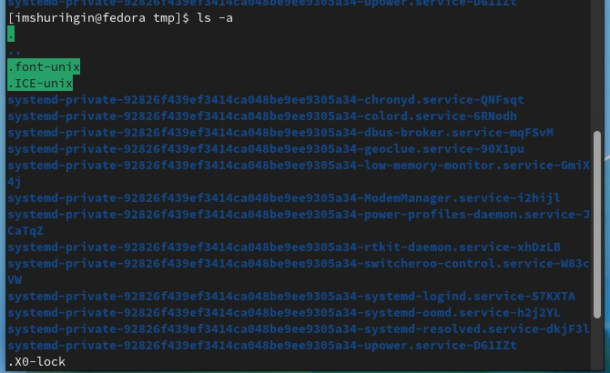

---
## Front matter
title: "ОТЧЕТ 
ПО ЛАБОРАТОРНОЙ РАБОТЕ №4"
subtitle: "Взаимодействие с Unix на уровне командной строки"
author: "Шурыгин Илья Максимович"

## Generic otions
lang: ru-RU
toc-title: "Содержание"

## Bibliography
bibliography: bib/cite.bib
csl: pandoc/csl/gost-r-7-0-5-2008-numeric.csl

## Pdf output format
toc: true # Table of contents
toc-depth: 2
lof: true # List of figures
lot: true # List of tables
fontsize: 12pt
linestretch: 1.5
papersize: a4
documentclass: scrreprt
## I18n polyglossia
polyglossia-lang:
  name: russian
  options:
	- spelling=modern
	- babelshorthands=true
polyglossia-otherlangs:
  name: english
## I18n babel
babel-lang: russian
babel-otherlangs: english
## Fonts
mainfont: PT Serif
romanfont: PT Serif
sansfont: PT Sans
monofont: PT Mono
mainfontoptions: Ligatures=TeX
romanfontoptions: Ligatures=TeX
sansfontoptions: Ligatures=TeX,Scale=MatchLowercase
monofontoptions: Scale=MatchLowercase,Scale=0.9
## Biblatex
biblatex: true
biblio-style: "gost-numeric"
biblatexoptions:
  - parentracker=true
  - backend=biber
  - hyperref=auto
  - language=auto
  - autolang=other*
  - citestyle=gost-numeric
## Pandoc-crossref LaTeX customization
figureTitle: "Рис."
tableTitle: "Таблица"
listingTitle: "Листинг"
lofTitle: "Список иллюстраций"
lotTitle: "Список таблиц"
lolTitle: "Листинги"
## Misc options
indent: true
header-includes:
  - \usepackage{indentfirst}
  - \usepackage{float} # keep figures where there are in the text
  - \floatplacement{figure}{H} # keep figures where there are in the text
---

# Цель работы

Целью моей работы является: приобрести практические навыки взаимодействия пользователя с системой посредством командной строки.

# Задание

Необходимо научиться при помощи командной строки создавать и удалять каталоги, перемещаться по файловой системе, узнавать путь данного файла или каталога.

# Выполнение лабораторной работы

1. Определим полное имя домашнего каталога. Далее прейдем в каталог /tmp и выведем на экран его содержимое.(рис. [-@fig:001])

{ #fig:001 width=70% }

2. Затем выведем имена скрытых файлов в /tmp, для этого необходимо использовать команду ls с опцией a.(рис. [-@fig:002])

{ #fig:002 width=70% }

3. Проверим есть ли в каталоге /var/spool подкаталог с именем cron. Его там нет.(рис. [-@fig:003])

{ #fig:003 width=70% }

4. Перейдем в домашний каталог и выведем на экран его содержимое. Видно, что владельцем почти всех файлов являюсь я.(рис. [-@fig:004])

{ #fig:004 width=70% }

5. В домашнем каталоге создадим новый каталог с именем newdir. А затем в каталоге ~/newdir создадим новый каталог с именем morefun.(рис. [-@fig:005])

{ #fig:005 width=70% }

6. В домашнем каталоге создадим одной командой три новых каталога с именами letters, memos, misk, а затем удалим эти каталоги также одной командой.(рис. [-@fig:006])

{ #fig:006 width=70% }

7. Удалим каталог ~/newdir/morefun из домашнего каталога.(рис. [-@fig:007])

{ #fig:007 width=70% }

8. Для просмотра содержимого не только указанного каталога, но и подкаталогов, входящих в него нужно использовать опцию -R команды ls.(рис. [-@fig:008])

{ #fig:008 width=70% }

9. Опция -ltr команды ls позволяет отсортировать по времени последнего изменения выводимый список содержимого каталога с развёрнутым описанием файлов.(рис. [-@fig:009])

{ #fig:009 width=70% }

10. Основные опции этих команд cd, pwd, mkdir, rmdir и rm.(рис. [-@fig:010])(рис. [-@fig:011])(рис. [-@fig:012])

{ #fig:010 width=70% }

{ #fig:011 width=70% }

{ #fig:012 width=70% }

11. При помощи команды history выполним модификацию команды: man rmkdir на man ls.(рис. [-@fig:013])

{ #fig:013 width=70% }

# Контрольные вопросы:

1. Что такое командная строка?

- Терминал для работы с файлами, каталогами.

2. При помощи какой команды можно определить абсолютный путь текущего каталога?

- pwd

3. При помощи какой команды и каких опций можно определить только тип файлов и их имена в текущем каталоге? Приведите примеры.

- ls -l

4. Каким образом отобразить информацию о скрытых файлах? Приведите примеры.

- ls -a

5. При помощи каких команд можно удалить файл и каталог? Можно ли это сделать одной и той же командой? Приведите примеры.

- rm/rmdir рм не удалит не пустой каталог.

6. Каким образом можно вывести информацию о последних выполненных пользователем командах?

- history

7. Как воспользоваться историей команд для их модифицированного выполнения? Приведите примеры.

- !<номер команды>:s/что меняем/на что меняем

8. Приведите примеры запуска нескольких команд в одной строке.

- cd; ls

9. Дайте определение и приведите пример символов экранирования.

- символы замены стандартных слов: ~ == home.

10. Охарактеризуйте вывод информации на экран после выполнения команды ls с опцией l.

- Вывод расширенной информации о файле - вес, название, защита.

11. Что такое относительный путь к файлу? Приведите примеры использования относительного и абсолютного пути при выполнении какой-либо команды.

- Относительный путь — это путь к файлу относительно текущего каталога. Пример: ./Documents/images. В случае абсолютной адресации путь к каталогу указывается, начиная с корневого каталога. Например: /home/pl/Desktop.

12. Как получить информацию об интересующей вас команде?

- man

13. Какая клавиша или комбинация клавиш служит для автоматического дополнения вводимых команд?

- Ctrl+R или клавиша TAB

# Выводы

Вывод: я создал несколько новых каталогов, просмотрел их файлы, удалил их. Смог изменить команду из истории.
