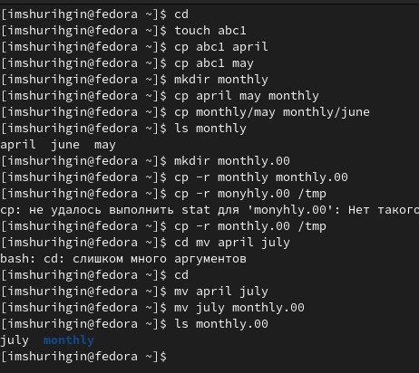
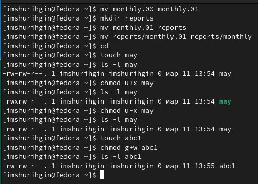
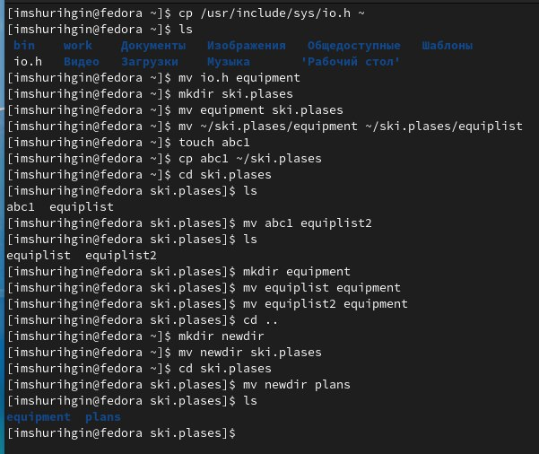
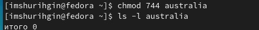
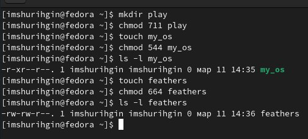
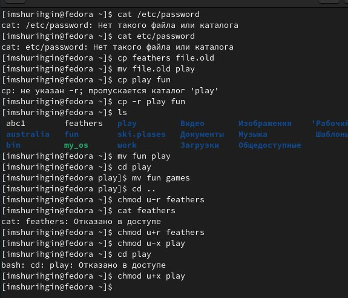
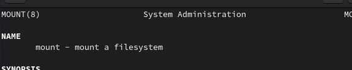
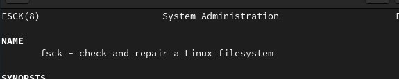
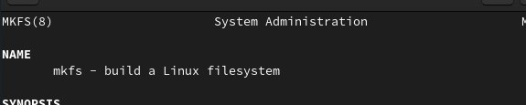

---
## Front matter
lang: ru-RU
title: Лабораторная работа №5
subtitle: Анализ файловой системы Linux
author:
  - Шурыгин Илья
institute:
  - Российский университет дружбы народов, Москва, Россия
date: 11 марта 2023

## i18n babel
babel-lang: russian
babel-otherlangs: english

## Formatting pdf
toc: false
toc-title: Содержание
slide_level: 2
aspectratio: 169
section-titles: true
theme: metropolis
header-includes:
  - \metroset{progressbar=frametitle,sectionpage=progressbar,numbering=fraction}
  - '\makeatletter'
  - '\beamer@ignorenonframefalse'
  - '\makeatother'
---

# Информация

## Докладчик

:::::::::::::: {.columns align=center}
::: {.column width="70%"}

- Шурыгин Илья Максимович
- студент-первокурсник
- Российский университет дружбы народов
- <https://github.com/IlyShaSh>

:::
::::::::::::::

# Вводная часть

## Цели и задачи

Целью моей работы является: ознакомление с файловой системой Linux, её структурой, именами и содержанием каталогов. Приобретение практических навыков по применению команд для работы с файлами и каталогами, по управлению процессами, по проверке использования диска и обслуживанию файловой системы.

# Ход работы

## Выполним все примеры, приведённые в первой части описания лабораторной работы

{ #fig:001 width=70% }

##

{ #fig:002 width=70% }

##

Затем скопируем файл /usr/include/sys/io.h в домашний каталог и назовем его equipment. В домашнем каталоге создаидим директорию ski.plases и переместим файл equipment в нее

{ #fig:003 width=50% }

##

Далее переименуем файл equipment в equiplist. Создадим в домашнем каталоге файл abc1 и скопируем его в каталог ski.plases, назвав его equiplist2.

{ #fig:003 width=50% }

## Создадим каталог с именем equipment в каталоге ski.plases. Переместим файлы ski.plases/equiplist и equiplist2 в каталог ski.plases/equipment

{ #fig:003 width=70% }

## Создадим и переместим каталог ~/newdir в каталог ski.plases и назовем его plans

{ #fig:003 width=70% }

## Определим опции команды chmod, необходимые для того,чтобы присвоить файлам права доступа

{ #fig:004 width=50% }

{ #fig:005 width=50% }

## Просмотрим содержимое файла /etc/password. Скопируем файл ~/feathers в файл ~/file.old. Переместим файл ~/file.old в каталог ~/play.

{ #fig:006 width=60% }

## Скопируем каталог ~/play в каталог ~/fun. Переместим каталог ~/fun в каталог ~/play и назовем его games. Лишим владельца файла ~/feathers права на чтение.

{ #fig:006 width=60% }

## Дадим владельцу файла ~/feathers право на чтение. Лишим владельца каталога ~/play права на выполнение. А затем вернем владельцу право на выполнение.

{ #fig:006 width=60% }

## Основное назначение команд mount, fsck, mkfs, kill.

{ #fig:007 width=40% }

{ #fig:008 width=40% }

##

{ #fig:009 width=40% }

{ #fig:009 width=40% }

# Контрольные вопросы:

## Дайте характеристику каждой файловой системе, существующей на жёстком диске компьютера, на котором вы выполняли лабораторную работу.

- Ext2, Ext3, Ext4 или Extended Filesystem - это стандартная файловая система для Linux. Она была разработана еще для Minix. Она самая стабильная из всех существующих, кодовая база изменяется очень редко и эта файловая система содержит больше всего функций. Версия ext2 была разработана уже именно для Linux и получила много улучшений.

## Приведите общую структуру файловой системы и дайте характеристику каждой директории первого уровня этой структуры.

- / — root каталог. Содержит в себе всю иерархию системы; /bin — здесь находятся двоичные исполняемые файлы. Основные общие команды, хранящиеся отдельно от других программ в системе (прим.: pwd, ls, cat, ps); /boot — тут расположены файлы, используемые для загрузки системы (образ initrd, ядро vmlinuz);

##

/dev — в данной директории располагаются файлы устройств (драйверов). С помощью этих файлов можно взаимодействовать с устройствами. К примеру, если это жесткий диск, можно подключить его к файловой системе. В файл принтера же можно написать напрямую и отправить задание на печать; /etc — в этой директории находятся файлы конфигураций программ. Эти файлы позволяют настраивать системы, сервисы, скрипты системных демонов;

##

/home — каталог, аналогичный каталогу Users в Windows. Содержит домашние каталоги учетных записей пользователей (кроме root). При создании нового пользователя здесь создается одноименный каталог с аналогичным именем и хранит личные файлы этого пользователя; /lib — содержит системные библиотеки, с которыми работают программы и модули ядра; /lost+found — содержит файлы, восстановленные после сбоя работы системы. Система проведет проверку после сбоя и найденные файлы можно будет посмотреть в данном каталоге; /media — точка монтирования внешних носителей. Например, когда вы вставляете диск в дисковод, он будет автоматически смонтирован в директорию /media/cdrom;

##

/mnt — точка временного монтирования. Файловые системы подключаемых устройств обычно монтируются в этот каталог для временного использования; /opt — тут расположены дополнительные (необязательные) приложения. Такие программы обычно не подчиняются принятой иерархии и хранят свои файлы в одном подкаталоге (бинарные, библиотеки, конфигурации);

##

/proc — содержит файлы, хранящие информацию о запущенных процессах и о состоянии ядра ОС; /root — директория, которая содержит файлы и личные настройки суперпользователя; /run — содержит файлы состояния приложений. Например, PID-файлы или UNIX-сокеты; /sbin — аналогично /bin содержит бинарные файлы.

## Какая операция должна быть выполнена, чтобы содержимое некоторой файловой системы было доступно операционной системе?

- Монтирование тома.

## Назовите основные причины нарушения целостности файловой системы. Как устранить повреждения файловой системы?

- Один блок адресуется несколькими mode (принадлежит нескольким файлам). Блок помечен как свободный, но в то же время занят (на него ссылается onode). Блок помечен как занятый, но в то же время свободен (ни один inode на него не ссылается).

##

Неправильное число ссылок в inode (недостаток или избыток ссылающихся записей в каталогах). Несовпадение между размером файла и суммарным размером адресуемых inode блоков. Недопустимые адресуемые блоки (например, расположенные за пределами файловой системы). "Потерянные" файлы (правильные inode, на которые не ссылаются записи каталогов). Недопустимые или неразмещенные номера inode в записях каталогов.

## Как создаётся файловая система?

- mkfs - позволяет создать файловую систему Linux.

## Дайте характеристику командам для просмотра текстовых файлов.

- Cat - выводит содержимое файла на стандартное устройство вывода

## Приведите основные возможности команды cp в Linux.

- Cp – копирует или перемещает директорию, файлы.

## Приведите основные возможности команды mv в Linux.

- Mv - переименовать или переместить файл или директорию

## Что такое права доступа? Как они могут быть изменены?

- Права доступа к файлу или каталогу можно изменить, воспользовавшись командой chmod. Сделать это может владелец файла (или каталога) или пользователь с правами администратора.

## Выводы

Вывод: я научился взаимодействовать с фалайми и каталогами, а именно: копировать, переименовывать, перемещать, изменять права доступа.

# Результаты

## Заключение

Был получен навык взаимодействия с файлами и каталогами посредством командной строки. Цель работы была достигнута.
