---
## Front matter
lang: ru-RU
title: Лабораторная работа №6
subtitle: Поиск файлов. Перенаправление ввода-вывода
author:
  - Шурыгин Илья
institute:
  - Российский университет дружбы народов, Москва, Россия
date: 11 марта 2023

## i18n babel
babel-lang: russian
babel-otherlangs: english

## Formatting pdf
toc: false
toc-title: Содержание
slide_level: 2
aspectratio: 169
section-titles: true
theme: metropolis
header-includes:
  - \metroset{progressbar=frametitle,sectionpage=progressbar,numbering=fraction}
  - '\makeatletter'
  - '\beamer@ignorenonframefalse'
  - '\makeatother'
---

# Информация

## Докладчик

:::::::::::::: {.columns align=center}
::: {.column width="70%"}

- Шурыгин Илья Максимович
- студент-первокурсник
- Российский университет дружбы народов
- <https://github.com/IlyShaSh>

:::
::::::::::::::

# Вводная часть

## Цели и задачи

Целью моей работы является: ознакомление с инструментами поиска файлов и фильтрации текстовых данных. Приобретение практических навыков: по управлению процессами (и заданиями), по проверке использования диска и обслуживанию файловых систем.

# Ход работы

## Запишем в файл file.txt названия файлов, содержащихся в каталоге /etc. Допишем в этот же файл названия файлов, содержащихся в домашнем каталоге

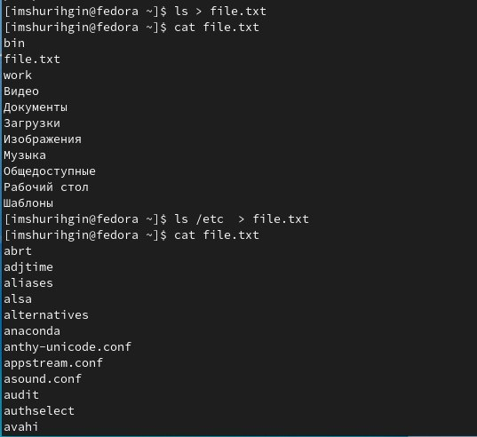{ #fig:001 width=60% }

## Затем запишем имена всех файлов из file.txt, имеющих расширение .conf, в новый текстовой файл conf.txt

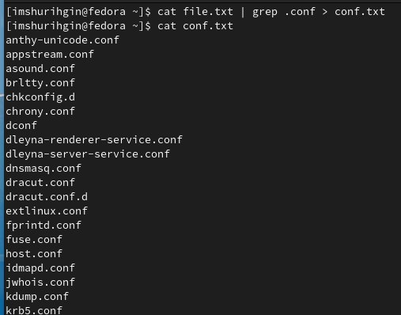{ #fig:002 width=70% }

## Определим, какие файлы в домашнем каталоге имеют имена, начинавшиеся с символа c, с помощью команды find.

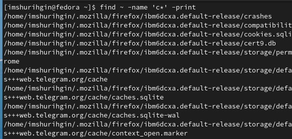{ #fig:003 width=70% }

## Затем выведем на экран имена файлов из каталога /etc, начинающихся с символа h.

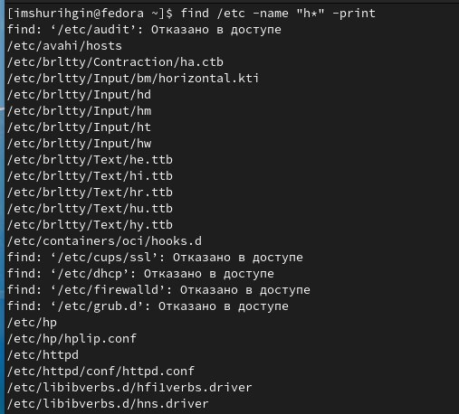{ #fig:004 width=70% }

## Запустим в фоновом режиме процесс, который будет записывать в файл ~/logfile файлы, имена которых начинаются с log.

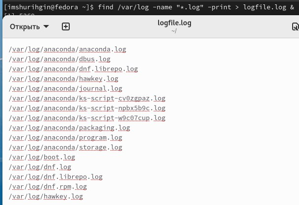{ #fig:005 width=70% }

## Удалим файл ~/logfile и запустим из консоли в фоновом режиме редактор gedit

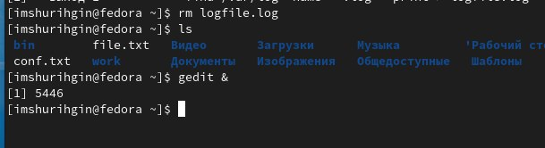{ #fig:006 width=70% }

## Определим идентификатор процесса gedit.

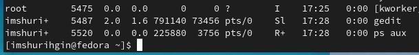{ #fig:007 width=70% }

## Используем команду kill для завершения процесса gedit.

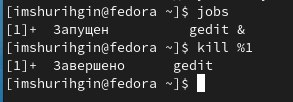{ #fig:008 width=70% }

## Выполним команды df и du.

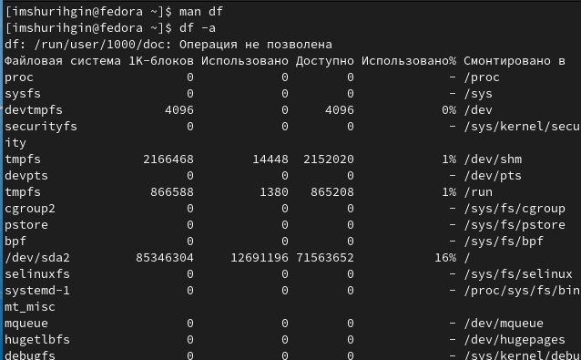{ #fig:009 width=60% }

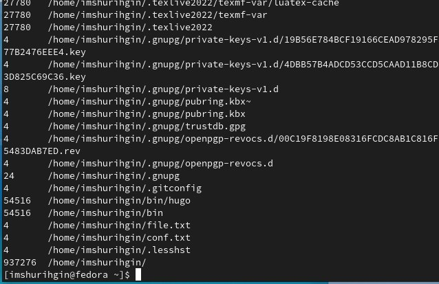{ #fig:010 width=60% }

## Воспользовавшись справкой команды find, выведем имена всех директорий, имеющихся в домашнем каталоге.

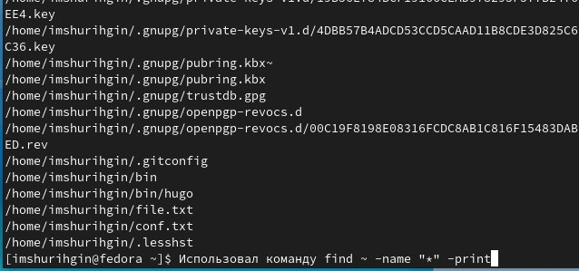{ #fig:011 width=70% }

# Контрольные вопросы:

## Какие потоки ввода вывода вы знаете?

- Stdin и stdout, stderr

## Объясните разницу между операцией > и >>.

- Первый перенаправляет, а второй открывает в режиме добавления.

## Что такое конвейер?

- Конвейер (pipe) служит для объединения простых команд или утилит в цепочки, в которых результат работы предыдущей команды передаётся последующей.

## Что такое процесс? Чем это понятие отличается от программы?

- Компьютерная программа сама по себе — лишь пассивная последовательность инструкций. В то время как процесс — непосредственное выполнение этих инструкций. Также, процессом называют выполняющуюся программу и все её элементы: адресное пространство, глобальные переменные, регистры, стек, открытые файлы и так далее.

## Что такое PID и GID?

- PID – это айди процесса.

- GID - Группы пользователей применяются для организации доступа нескольких пользователей к некоторым ресурсам.

## Что такое задачи и какая команда позволяет ими управлять?

- Любую выполняющуюся в консоли команду или внешнюю программу можно запустить в фоновом режиме. Для этого следует в конце имени команды указать знак амперсанда &. Например: gedit &.

## Найдите информацию об утилитах top и htop. Каковы их функции?

- Top - отобразить запущенные процессы, используемые ими ресурсы и другую полезную информацию (с автоматическим обновлением данных)

- Htop - показывает динамический список системных процессов, список обычно выравнивается по использованию ЦПУ. В отличие от top, htop показывает все процессы в системе. Также показывает время непрерывной работы, использование процессоров и памяти. Htop часто применяется в тех случаях, когда информации даваемой утилитой top недостаточно, например при поиске утечек памяти в процессах.

## Назовите и дайте характеристику команде поиска файлов. Приведите примеры использования этой команды.

- Команда find используется для поиска и отображения на экран имён файлов, соответствующих заданной строке символов. Формат команды: find путь "опции"

## Можно ли по контексту (содержанию) найти файл? Если да, то как?

- Да, через команду grep. Например: grep Aug -R /var/log/ вывода строки, содержащие "Aug", во всех файлах, находящихся в директории /var/log и ниже

## Как определить объем свободной памяти на жёстком диске?

- Для определения объёма свободного пространства на файловой системе можно воспользоваться командой df, которая выведет на экран список всех файловых систем в соответствии с именами устройств, с указанием размера и точки монтирования.

## Как определить объем вашего домашнего каталога?

- Команда du показывает число килобайт, используемое каждым файлом или каталогом.

## Как удалить зависший процесс?

- Можно удалить через kill, написав айди процесса

## Выводы

Вывод: я научился взаимодействовать с фалайми: записывать в них данные, искать нужную строку по названию.

# Результаты

## Заключение

Был получен навык взаимодействия с файлами посредством командной строки. Цель работы была достигнута.
