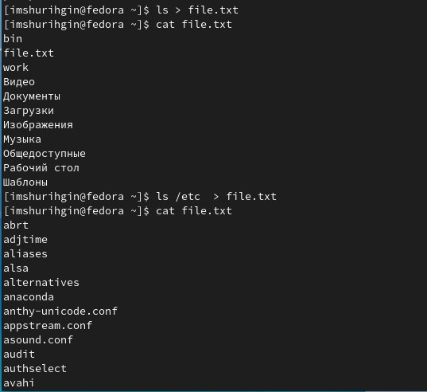
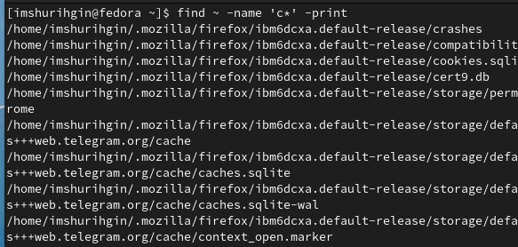
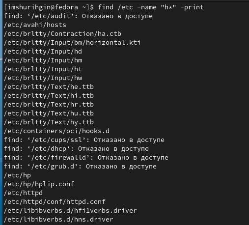
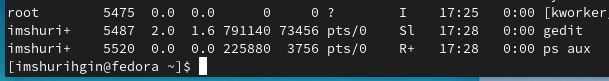
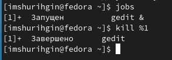

---
## Front matter
title: "ОТЧЕТ 
ПО ЛАБОРАТОРНОЙ РАБОТЕ №6"
subtitle: "Поиск файлов. Перенаправление ввода-вывода"
author: "Шурыгин Илья Максимович"

## Generic otions
lang: ru-RU
toc-title: "Содержание"

## Bibliography
bibliography: bib/cite.bib
csl: pandoc/csl/gost-r-7-0-5-2008-numeric.csl

## Pdf output format
toc: true # Table of contents
toc-depth: 2
lof: true # List of figures
lot: true # List of tables
fontsize: 12pt
linestretch: 1.5
papersize: a4
documentclass: scrreprt
## I18n polyglossia
polyglossia-lang:
  name: russian
  options:
	- spelling=modern
	- babelshorthands=true
polyglossia-otherlangs:
  name: english
## I18n babel
babel-lang: russian
babel-otherlangs: english
## Fonts
mainfont: PT Serif
romanfont: PT Serif
sansfont: PT Sans
monofont: PT Mono
mainfontoptions: Ligatures=TeX
romanfontoptions: Ligatures=TeX
sansfontoptions: Ligatures=TeX,Scale=MatchLowercase
monofontoptions: Scale=MatchLowercase,Scale=0.9
## Biblatex
biblatex: true
biblio-style: "gost-numeric"
biblatexoptions:
  - parentracker=true
  - backend=biber
  - hyperref=auto
  - language=auto
  - autolang=other*
  - citestyle=gost-numeric
## Pandoc-crossref LaTeX customization
figureTitle: "Рис."
tableTitle: "Таблица"
listingTitle: "Листинг"
lofTitle: "Список иллюстраций"
lotTitle: "Список таблиц"
lolTitle: "Листинги"
## Misc options
indent: true
header-includes:
  - \usepackage{indentfirst}
  - \usepackage{float} # keep figures where there are in the text
  - \floatplacement{figure}{H} # keep figures where there are in the text
---

# Цель работы

Целью моей работы является: ознакомление с инструментами поиска файлов и фильтрации текстовых данных. Приобретение практических навыков: по управлению процессами (и заданиями), по проверке использования диска и обслуживанию файловых систем.

# Задание

Необходимо научиться находить файлы, записывать в них данные, фильтровать текстовые данные.

# Выполнение лабораторной работы

1. Запишем в файл file.txt названия файлов, содержащихся в каталоге /etc. Допишем в этот же файл названия файлов, содержащихся в домашнем каталоге.

{ #fig:001 width=70% }

2. Затем запишем имена всех файлов из file.txt, имеющих расширение .conf, в новый текстовой файл conf.txt.

{ #fig:002 width=70% }

3. Определим, какие файлы в домашнем каталоге имеют имена, начинавшиеся с символа c, с помощью команды find.

{ #fig:003 width=70% }

4. Затем выведем на экран имена файлов из каталога /etc, начинающихся с символа h.

{ #fig:004 width=70% }

5. Запустим в фоновом режиме процесс, который будет записывать в файл ~/logfile файлы, имена которых начинаются с log.

{ #fig:005 width=70% }

6. Удалим файл ~/logfile и запустим из консоли в фоновом режиме редактор gedit.

{ #fig:006 width=70% }

7. Определим идентификатор процесса gedit.

{ #fig:007 width=70% }

8. Используем команду kill для завершения процесса gedit.

{ #fig:008 width=70% }

9. Выполним команды df и du.

{ #fig:009 width=70% }

{ #fig:010 width=70% }

10. Воспользовавшись справкой команды find, выведем имена всех директорий, имеющихся в домашнем каталоге.

{ #fig:011 width=70% }

# Контрольные вопросы:

1. Какие потоки ввода вывода вы знаете?

- Stdin и stdout, stderr

2. Объясните разницу между операцией > и >>.

- Первый перенаправляет, а второй открывает в режиме добавления.

3. Что такое конвейер?

- Конвейер (pipe) служит для объединения простых команд или утилит в цепочки, в которых результат работы предыдущей команды передаётся последующей.

4. Что такое процесс? Чем это понятие отличается от программы?

- Компьютерная программа сама по себе — лишь пассивная последовательность инструкций. В то время как процесс — непосредственное выполнение этих инструкций. Также, процессом называют выполняющуюся программу и все её элементы: адресное пространство, глобальные переменные, регистры, стек, открытые файлы и так далее.

5. Что такое PID и GID?

- PID – это айди процесса.

- GID - Группы пользователей применяются для организации доступа нескольких пользователей к некоторым ресурсам.

6. Что такое задачи и какая команда позволяет ими управлять?

- Любую выполняющуюся в консоли команду или внешнюю программу можно запустить в фоновом режиме. Для этого следует в конце имени команды указать знак амперсанда &. Например: gedit &.

7. Найдите информацию об утилитах top и htop. Каковы их функции?

- Top - отобразить запущенные процессы, используемые ими ресурсы и другую полезную информацию (с автоматическим обновлением данных)

- Htop - показывает динамический список системных процессов, список обычно выравнивается по использованию ЦПУ. В отличие от top, htop показывает все процессы в системе. Также показывает время непрерывной работы, использование процессоров и памяти. Htop часто применяется в тех случаях, когда информации даваемой утилитой top недостаточно, например при поиске утечек памяти в процессах.

8. Назовите и дайте характеристику команде поиска файлов. Приведите примеры использования этой команды.

- Команда find используется для поиска и отображения на экран имён файлов, соответствующих заданной строке символов. Формат команды: find путь "опции"

9. Можно ли по контексту (содержанию) найти файл? Если да, то как?

- Да, через команду grep. Например: grep Aug -R /var/log/ вывода строки, содержащие "Aug", во всех файлах, находящихся в директории /var/log и ниже

10. Как определить объем свободной памяти на жёстком диске?

- Для определения объёма свободного пространства на файловой системе можно воспользоваться командой df, которая выведет на экран список всех файловых систем в соответствии с именами устройств, с указанием размера и точки монтирования.

11. Как определить объем вашего домашнего каталога?

- Команда du показывает число килобайт, используемое каждым файлом или каталогом.

12. Как удалить зависший процесс?

- Можно удалить через kill, написав айди процесса

# Выводы

Вывод: я научился взаимодействовать с фалайми: записывать в них данные, искать нужную строку по названию.
