---
## Front matter
lang: ru-RU
title: Лабораторная работа №7
subtitle: Командная оболочка Midnight Commander
author:
  - Шурыгин Илья
institute:
  - Российский университет дружбы народов, Москва, Россия
date: 11 марта 2023

## i18n babel
babel-lang: russian
babel-otherlangs: english

## Formatting pdf
toc: false
toc-title: Содержание
slide_level: 2
aspectratio: 169
section-titles: true
theme: metropolis
header-includes:
  - \metroset{progressbar=frametitle,sectionpage=progressbar,numbering=fraction}
  - '\makeatletter'
  - '\beamer@ignorenonframefalse'
  - '\makeatother'
---

# Информация

## Докладчик

:::::::::::::: {.columns align=center}
::: {.column width="70%"}

- Шурыгин Илья Максимович
- студент-первокурсник
- Российский университет дружбы народов
- <https://github.com/IlyShaSh>

:::
::::::::::::::

# Вводная часть

## Цели и задачи

Целью моей работы является: освоение основных возможностей командной оболочки Midnight Commander. Приобретение навыков практической работы по просмотру каталогов и файлов; манипуляций с ними.

# Ход работы

## Изучим информацию о mc, вызвав в командной строке man mc.

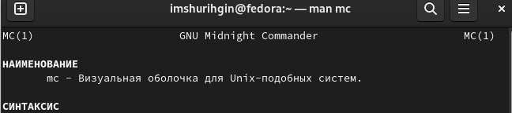{ #fig:001 width=70% }

## Затем запустим из командной строки mc,изучим его структуру и меню. Просмотрим дерево каталогов.

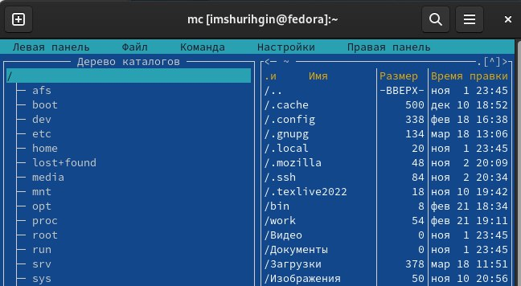{ #fig:002 width=70% }

## Просмотрим содержимое текстового файла, отредактируем и сохраним изменения.

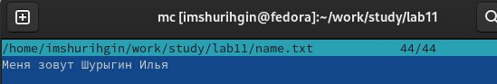{ #fig:003 width=40% }

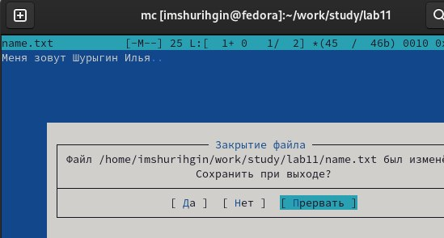{ #fig:004 width=40% }

## Затем создадим новый каталог и скопируем в него текстовый файл.

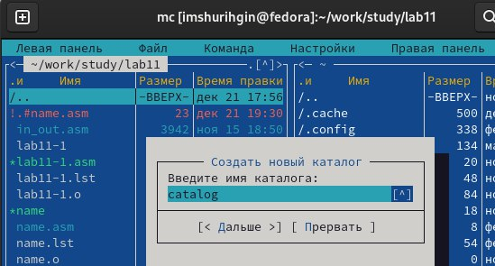{ #fig:005 width=40% }

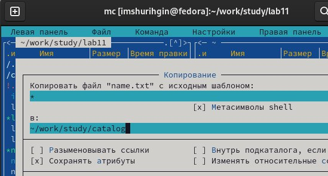{ #fig:006 width=40% }

## Далее найдем в файловой системе файл, содержащий строку main.

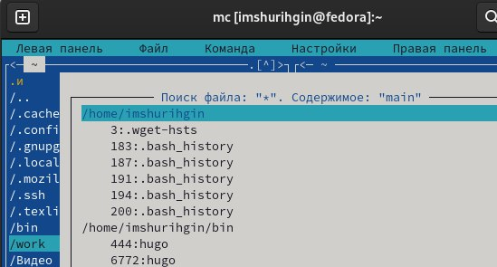{ #fig:007 width=70% }

## Перейдем в домашний каталог.

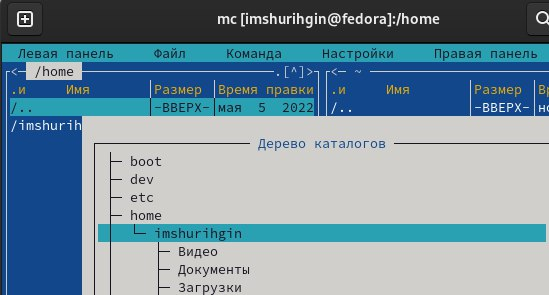{ #fig:008 width=70% }

## Вызовем подменю Настройки и изменим "Показывать скрытые файлы".

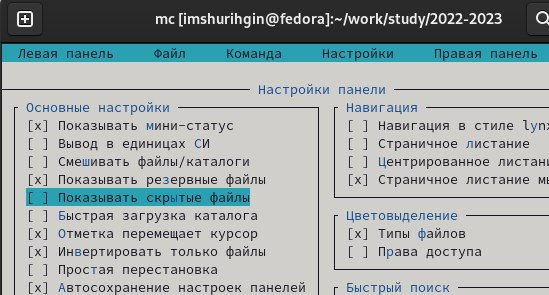{ #fig:009 width=70% }

## Создадим текстовый файл и проделаем в нем несколько манипуляций: удалим строку, перенесем строку, скопируем строку. Затем выйдем и сохраним изменения.

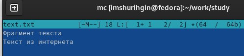{ #fig:010 width=50% }

##

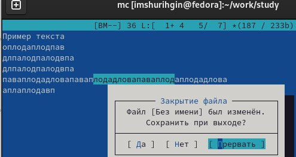{ #fig:011 width=70% }

# Контрольные вопросы:

## Какие режимы работы есть в mc. Охарактеризуйте их.

- mc - визуальная файловая оболочка для UNIX/Linux систем, аналог Far, Norton Commander, но оболочки в Linux несравненно богаче. На языке командной оболочки можно писать небольшие программы для выполнения ряда последовательных операций с файлами и содержащимися в них данными. Команда Переставить панели (Ctrl+U) меняет местами содержимое правой и левой панелей.Команде Отключить панели (Ctrl+O). По команде Сравнить каталоги (Ctrl-X,D) сравнивается содержимое каталогов, отображаемых на левой и правой панелях. Помимо того, что может задаваться формат вывода на панель списка файлов, любую панель можно перевести в один из следующих режимов:

##

- Режим “Информация”. В этом режиме на панель выводится информация о подсвеченном в другой панели файле и о текущей файловой системе.

- Режим “Дерево”. В режиме отображения дерева каталогов в одной из панелей выводится графическое изображение структуры дерева каталогов. Этот режим подобен тому, который вы увидите, выбрав команду Дерево каталогов из меню Команды, только в последнем случае изображение структуры каталогов выводится в отдельное окно. Левая Панель и Правая Панель меню (левой/правой панели) позволяют оперировать режимами отображения панелей. Меню Левая Панель и Правая Панель позволяют оперировать панелями. Формат списка бывает:

##

- Стандартный – вывод списка файлов и каталогов по умолчанию;

- Ускоренный – имена файла или каталогов;

- Расширенный – атрибуты, владелец, группа и размер;

- Определённый пользователем – имя, размер и атрибуты; Быстрый просмотр – выполняет быстрый просмотр содержимого панели. Информация – выдает всю имеющуюся информацию о файле или каталоге. Порядок сортировки – бывает: без сортировки, по имени, расширенный, время правки, время правки, время доступа, время изменение атрибута, размер, узел.

## Какие операции с файлами можно выполнить как с помощью команд shell, так и с помощью меню (комбинаций клавиш) mc? Приведите несколько примеров.

- Системная информация

- Поиск

- Копирование

## Опишите структура меню левой (или правой) панели mc, дайте характеристику командам.

- Список файлов показывает файлы в домашнем каталоге.

- Быстрый просмотр позволяет выполнить быстрый просмотр содержимого панели.

- Информация позволяет посмотреть информацию о файле или каталоге

##

- Командная оболочка Midnight Commander В меню каждой (левой или правой) панели можно выбрать Формат списка: стандартный, ускоренный, расширенный и определённый пользователем.

- Порядок сортировки позволяет задать критерии сортировки при выводе списка файлов и каталогов: без сортировки, по имени, расширенный, время правки, время доступа, время изменения атрибута, размер, узел.

## Опишите структура меню Файл mc, дайте характеристику командам.

- Просмотр ( F3 ) позволяет посмотреть содержимое текущего файла без возможности редактирования.

- Просмотр вывода команды ( М + ! ) функция запроса команды с параметрами.

- Правка ( F4 ) открывает текущий (или выделенный) файл для его редактирования.

- Копирование ( F5 ) осуществляет копирование одного или нескольких файлов или каталогов в указанное пользователем во всплывающем окне место.

##

- Права доступа ( Ctrl-x c ) позволяет изменить права доступа к одному или нескольким файлам или каталогам.

- Права доступа на файлы и каталоги

- Жёсткая ссылка ( Ctrl-x l ) позволяет создать жёсткую ссылку к текущему (или выделенному) файлу1 .

- Символическая ссылка ( Ctrl-x s ) — позволяет создать символическую ссылку к текущему файлу .

- Владелец группы ( Ctrl-x o ) позволяет задать владельца и имя группы для одного или нескольких файлов или каталогов.

##

- Права (расширенные) позволяет изменить права доступа и владения для одного или нескольких файлов или каталогов.

- Переименование ( F6 ) позволяет переименовать один или несколько файлов или каталогов.

- Создание каталога ( F7 ) позволяет создать каталог.

- Удалить ( F8 ) позволяет удалить один или несколько файлов или каталогов.

- Выход ( F10 ) завершает работу mc.

## Опишите структура меню Команда mc, дайте характеристику командам.

- Дерево каталогов отображает структуру каталогов системы.

- Поиск файла выполняет поиск файлов по заданным параметрам.

- Переставить панели меняет местами левую и правую панели.

- Сравнить каталоги ( Ctrl-x d ) сравнивает содержимое двух каталогов.

##

- Размеры каталогов отображает размер и время изменения каталога (по умол- чанию в mc размер каталога корректно не отображается).

- История командной строки выводит на экран список ранее выполненных в оболочке команд.

- Каталоги быстрого доступа ( Ctrl- ) при вызове выполняется быстрая смена текущего

- каталога на один из заданного списка.

- Восстановление файлов позволяет восстановить файлы на файловых систе- мах ext2 и ext3.

##

- Редактировать файл расширений позволяет задать с помощью определённого синтаксиса действия при запуске файлов с определённым расширением (напри- мер, какое программного обеспечение запускать для открытия или редактирова- ния файлов с расширением .c или .cpp).

- Редактировать файл меню позволяет отредактировать контекстное меню поль- зователя, вызываемое по клавише F2 .

- Редактировать файл расцветки имён позволяет подобрать оптимальную для пользователя расцветку имён файлов в зависимости от их типа.

## Опишите структура меню Настройки mc, дайте характеристику командам.

- Конфигурация позволяет скорректировать настройки работы с панелями.

- Внешний вид и Настройки панелей определяет элементы, отображаемые при вызове mc, а также цветовое выделение.

- Биты символов задаёт формат обработки информации локальным термина- лом.

##

- Подтверждение позволяет установить или убрать вывод окна с запросом подтверждения действий при операциях удаления и перезаписи файлов, а также при выходе из программы.

- Распознание клавиш диалоговое окно используется для тестирования функциональных клавиш, клавиш управления курсором и прочее.

- Виртуальные ФС настройки виртуальной файловой системы: тайм-аут, пароль и прочее.

## Назовите и дайте характеристику встроенным командам mc.

- F1 Вызов контекстно-зависимой подсказки.

- F2 Вызов пользовательского меню с возможностью создания and/or.

- F3 Просмотр содержимого файла, на который указывает подсветка в активной панели.

- F4 Вызов встроенного в mc редактора для изменения содержания файла, на который

##

- F5 Копирование одного или нескольких файлов, отмеченных в первой (активной) панели, в каталог, отображаемый на второй панели.

- F6 Перенос одного или нескольких файлов, отмеченных в первой панели, в каталог, отображаемый на второй панели.

- F7 Создание подкаталога в каталоге, отображаемом в активной панели.

- F8 Удаление одного или нескольких файлов, отмеченных в первой панели файлов.

- F9 Вызов меню mc.

- F10 Выход из mc.

## Назовите и дайте характеристику командам встроенного редактора mc.

- Ctrl+y удалить строку.

- Ctrl+u отмена последней операции.

- Ins вставка/замена.

- F7 поиск.

- Shift+F7 повтор последней операции поиска.

- F4 замена файла.

##

- F3 первое нажатие начало выделения, второе это окончание выделения.

- F5 копировать выделенный фрагмент F6 переместить выделенный фрагмент.

- F8 удалить выделенный фрагмент.

- F2 записать изменения в файл.

- F10 выйти из редактора.

## Дайте характеристику средствам mc, которые позволяют создавать меню, определяемые пользователем.

- Один из четырех форматов списка в Midnight Commander –пользовательский, определённый самим пользователем позволяет ему редактировать меню любого из двух списков. А меню пользователя – это меню, состоящее из команд, определенных пользователем. При вызове меню используется файл ~/.mc.menu. Если такого файла нет, то по умолчанию используется системный файл меню /usr/lib/mc/mc.menu. Все строки в этих файлах , начинающиеся с пробела или табуляции, являются командами, которые выполняются при выборе записи.

## Дайте характеристику средствам mc, которые позволяют выполнять действия, определяемые пользователем, над текущим файлом.

- Когда мы выделяем файл не являющегося исполняемым, Midnight Commander сравнивает расширение выбранного файла с расширениями, прописанными в «файле расширений» ~/ mc.ext. Если в файле расширений найдется подраздел, задающий процедуры обработки файлов с данным расширением, то обработка файла производится в соответствии с заданными в этом подразделе командами и файлами:

##

- файл помощи для MC. /usr/lib/mc.hlp

- файл расширений, используемый по умолчанию. /usr/lib/mc/mc.ext

- файл расширений, конфигурации редактора. $HOME/.mc.ext

- системный инициализационный файл. /usr/lib/mc/mc.ini

- фаил который содержит основные установки. /usr/lib/mc/mc.lib

- инициализационный файл пользователя. Если он существует, то системный файл mc.ini игнорируется. $HOME/.mc.ini

##

- этот файл содержит подсказки, отображаемые в нижней части экрана. /usr/lib/mc/mc.hint

- системный файл меню MC, используемый по умолчанию. /usr/lib/mc/mc.menu

- файл меню пользователя. Если он существует, то системный файл меню игнорируется. $HOME/.mc.menu

- инициализационный файл пользователя. Если он существует, то системный файл mc.ini игнорируется. $HOME/.mc.tree

## Выводы

Вывод: я научился взаимодействовать с mc: создавать каталоги, файлы, копировать их и работать с ними.

# Результаты

## Заключение

Был получен навык взаимодействия с mc. Цель работы была достигнута.
