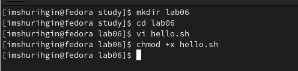
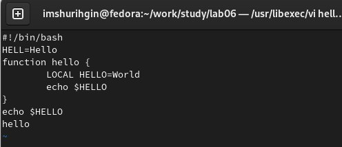
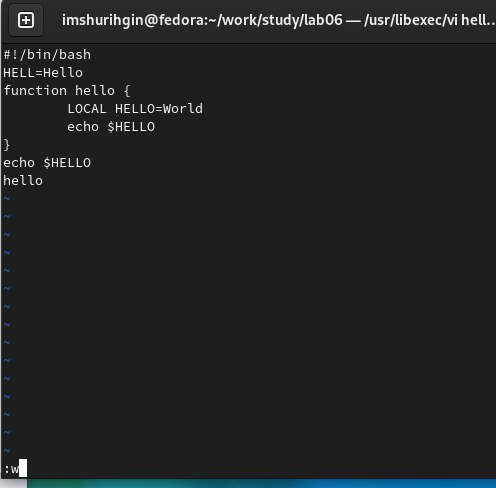
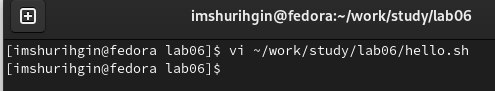
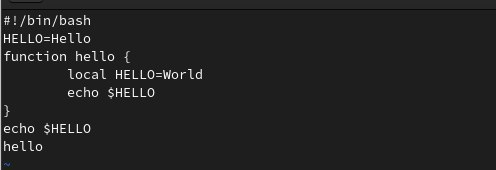

---
## Front matter
lang: ru-RU
title: Лабораторная работа №8
subtitle: Текстовый редактор vi
author:
  - Шурыгин Илья
institute:
  - Российский университет дружбы народов, Москва, Россия
date: 17 февраля 2023

## i18n babel
babel-lang: russian
babel-otherlangs: english

## Formatting pdf
toc: false
toc-title: Содержание
slide_level: 2
aspectratio: 169
section-titles: true
theme: metropolis
header-includes:
  - \metroset{progressbar=frametitle,sectionpage=progressbar,numbering=fraction}
  - '\makeatletter'
  - '\beamer@ignorenonframefalse'
  - '\makeatother'
---

# Информация

## Докладчик

:::::::::::::: {.columns align=center}
::: {.column width="70%"}

- Шурыгин Илья Максимович
- студент-первокурсник
- Российский университет дружбы народов
- <https://github.com/IlyShaSh>

:::
::::::::::::::

# Вводная часть

## Цели и задачи

Целью моей работы является: познакомиться с операционной системой Linux. Получить практические навыки работы с редактором vi, установленным по умолчанию практически во всех дистрибутивах.

# Ход работы

## Создадим каталог lab06, перейдем в него и создадим файл hello.sh.

{ #fig:003 width=70% }

## Затем нажмем i введем текст программы. После ввода перейдем в камандный режим при помощи Esc.

{ #fig:001 width=70% }

## Нажмем : для перехода в режим последней строки. После чего запишем изменения и завершим работу над файлом. Далее сделаем файл исполняемым: chmod +x hello.sh.

{ #fig:002 width=70% }

## Вызовем vi на редактирование файла.

{ #fig:005 width=70% }

## Заменим HELL на HELLO, а LOCAL на local и сохраним изменения.

{ #fig:004 width=70% }

# Контрольные вопросы

## Дайте краткую характеристику режимам работы редактора vi.

- Редактор vi имеет три режима работы: – командный режим — предназначен для ввода команд редактирования и навигации по редактируемому файлу; – режим вставки — предназначен для ввода содержания редактируемого файла; – режим последней (или командной) строки — используется для записи изменений в файл и выхода из редактора.

## Как выйти из редактора, не сохраняя произведённые изменения?

- Набрать символ q (или q!), если требуется выйти из редактора без сохранения.

## Назовите и дайте краткую характеристику командам позиционирования.

- 0 (ноль) — переход в начало строки;

- $ — переход в конец строки;

- G — переход в конец файла;

- nG — переход на строку с номером 𝑛.

## Что для редактора vi является словом?

- При использовании прописных W и B под разделителями понимаются только пробел, табуляция и возврат каретки. При использовании строчных w и b под разделителями понимаются также любые знаки пунктуации.

## Каким образом из любого места редактируемого файла перейти в начало (конец) файла?

- Для того, чтобы переместить курсор в начало файла, можно использовать команду 1G. Для перехода в конец файла необходимо нажать G.

## Назовите и дайте краткую характеристику основным группам команд редактирования.

- Команды редактирования: вставка текста, вставка строки, удаление текста, отмена и повтор произведённых изменений, копирование текста в буфер, вставка текста из буфера, замена текста, поиск текста.

## Необходимо заполнить строку символами $. Каковы ваши действия?

- Перейду в режим вставки и введу необходимое количество $.

## Как отменить некорректное действие, связанное с процессом редактирования?

- Отменить последнее действие с помощью команды u.

## Hазовите и дайте характеристику основным группам команд режима последней строки.

- Команды редактирования в режиме командной строки: копирование и перемещение текста, запись в файл и выход из редактора.

## Как определить, не перемещая курсора, позицию, в которой заканчивается строка?

- Необходимо перейти в конец строки с помощью $.

## Выполните анализ опций редактора vi (сколько их, как узнать их назначение и т.д.).

- Опции редактора vi позволяют настроить рабочую среду. Для задания опций используется команда set (в режиме последней строки):

• : set all — вывести полный список опций;

• : set nu — вывести номера строк;

##

• : set list — вывести невидимые символы;

• : set ic — не учитывать при поиске, является ли символ прописным или строчным. Если вы хотите отказаться от использования опции, то в команде set перед именем опции надо поставить no.

## Как определить режим работы редактора vi?

- Eсли в нижнем углу выводиться Insert - мы находимся в режиме вставки. Если курсор находится в конце файла и можно увидеть там двоеточие - режим последней (или командной) строки В ином случаи - мы находимся в командном режиме.

## Постройте граф взаимосвязи режимов работы редактора vi.

- командный режим.

- режим вставки.

- режим последней строки.

# Результаты

## Заключение

Я научился взаимодействовать с фалайми с помощью vi: записывать в них данные, заменять данные и устанавливать права.
