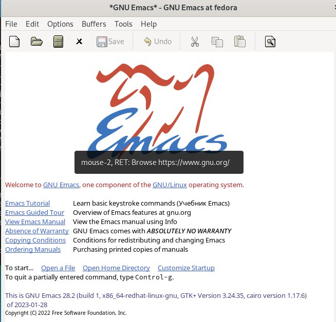
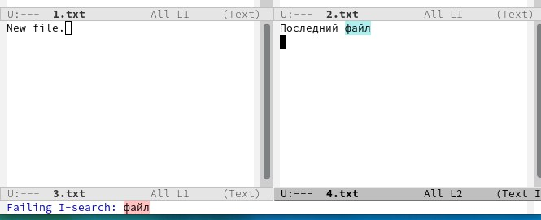

---
## Front matter
lang: ru-RU
title: Лабораторная работа №9
subtitle: Текстовый редактор emacs
author:
  - Шурыгин Илья
institute:
  - Российский университет дружбы народов, Москва, Россия
date: 17 февраля 2023

## i18n babel
babel-lang: russian
babel-otherlangs: english

## Formatting pdf
toc: false
toc-title: Содержание
slide_level: 2
aspectratio: 169
section-titles: true
theme: metropolis
header-includes:
  - \metroset{progressbar=frametitle,sectionpage=progressbar,numbering=fraction}
  - '\makeatletter'
  - '\beamer@ignorenonframefalse'
  - '\makeatother'
---

# Информация

## Докладчик

:::::::::::::: {.columns align=center}
::: {.column width="70%"}

- Шурыгин Илья Максимович
- студент-первокурсник
- Российский университет дружбы народов
- <https://github.com/IlyShaSh>

:::
::::::::::::::

# Вводная часть

## Цели и задачи

Целью моей работы является: познакомиться с операционной системой Linux. Получить практические навыки работы с редактором Emacs.

# Ход работы

## Скачаем и откроем emacs. Зетм создадим файл lab07.sh и наберем в нем код.

{ #fig:001 width=70% }

##

{ #fig:002 width=70% }

## Сохраним файл и проделаем с текстом стандартные процедуры редактирования.

{ #fig:003 width=70% }

##

{ #fig:004 width=70% }

##

{ #fig:005 width=70% }

## Выведем список активных буферов на экран (C-x C-b). Затем переключимся на другой буфер.

{ #fig:006 width=70% }

##

{ #fig:007 width=70% }

## Поделим фрейм на 4 части (C-x 3)(C-x 2).

{ #fig:008 width=70% }

## В каждом окне создадим новый файл и введем немного текста.

{ #fig:009 width=70% }

## Переключимся в режим поиска (C-s) и найдем несколько слов.

{ #fig:010 width=70% }

## Переключимся в режим поиска и замены (M-%) и заменим несколько слов.

{ #fig:011 width=70% }

# Контрольные вопросы

## Кратко охарактеризуйте редактор emacs.

- Emacs представляет собой мощный экранный редактор текста, написанный на языке высокого уровня Elisp

## Какие особенности данного редактора могут сделать его сложным для освоения новичком?

- Многие рутинные операции в Emacs удобнее производить с помощью клавиатуры, а не графического меню. Наиболее часто в командах Emacs используются сочетания c клавишами Ctrl и Meta (в обозначениях Emacs: C- и M-; клавиша Shift в Emasc обозначается как S-). Так как на клавиатуре для IBM PC совместимых ПК клавиши Meta нет, то вместо неё можно использовать Alt или Esc

## Своими словами опишите, что такое буфер и окно в терминологии emacs’а.

- Буфер - это файл, содержащий какой-либо текст. Окно же можно сказать область, где вы водится текст определенного буфера

## Можно ли открыть больше 10 буферов в одном окне?

- Можно открыть больше 10 буферов в одном окне

## Какие буферы создаются по умолчанию при запуске emacs?

- Только что запущенный Emacs несет один буфер с именем `scratch’, который может быть использован для вычисления выражений Лиспа в Emacs.

## Какие клавиши вы нажмёте, чтобы ввести следующую комбинацию C-c | и C-c C-|?

- Ctrl-c |(первые две нажму вместе, а третью отдельно), Ctrl-c Ctrl-|(каждую пару нажму раздельно).

## Как поделить текущее окно на две части?

- Разделить фрейм на два окна по вертикали (C-x 3),а по горизонтали (C-x 2)

## В каком файле хранятся настройки редактора emacs?

- В файле Emacs хранятся настройки редактора.

## Какую функцию выполняет клавиша и можно ли её переназначить?

- Кнопка BACKSPACE = функции C-k и ее можно переназначить.

## Какой редактор вам показался удобнее в работе vi или emacs?

- Поясните почему Редактор Emacs мне показался удобнее, так как в нем больше возможностей по сравнению с vi.

# Результаты

## Заключение

Я научился взаимодействовать с фалайми с помощью emacs: записывать в них данные, редактировать данные и сохранять изменения.
