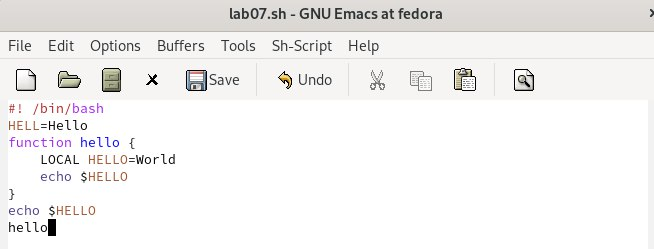
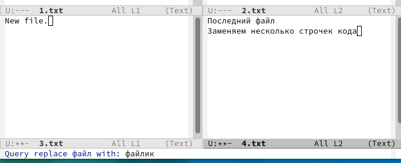

---
## Front matter
title: "ОТЧЕТ 
ПО ЛАБОРАТОРНОЙ РАБОТЕ №9"
subtitle: "Текстовой редактор emacs"
author: "Шурыгин Илья Максимович"

## Generic otions
lang: ru-RU
toc-title: "Содержание"

## Bibliography
bibliography: bib/cite.bib
csl: pandoc/csl/gost-r-7-0-5-2008-numeric.csl

## Pdf output format
toc: true # Table of contents
toc-depth: 2
lof: true # List of figures
lot: true # List of tables
fontsize: 12pt
linestretch: 1.5
papersize: a4
documentclass: scrreprt
## I18n polyglossia
polyglossia-lang:
  name: russian
  options:
	- spelling=modern
	- babelshorthands=true
polyglossia-otherlangs:
  name: english
## I18n babel
babel-lang: russian
babel-otherlangs: english
## Fonts
mainfont: PT Serif
romanfont: PT Serif
sansfont: PT Sans
monofont: PT Mono
mainfontoptions: Ligatures=TeX
romanfontoptions: Ligatures=TeX
sansfontoptions: Ligatures=TeX,Scale=MatchLowercase
monofontoptions: Scale=MatchLowercase,Scale=0.9
## Biblatex
biblatex: true
biblio-style: "gost-numeric"
biblatexoptions:
  - parentracker=true
  - backend=biber
  - hyperref=auto
  - language=auto
  - autolang=other*
  - citestyle=gost-numeric
## Pandoc-crossref LaTeX customization
figureTitle: "Рис."
tableTitle: "Таблица"
listingTitle: "Листинг"
lofTitle: "Список иллюстраций"
lotTitle: "Список таблиц"
lolTitle: "Листинги"
## Misc options
indent: true
header-includes:
  - \usepackage{indentfirst}
  - \usepackage{float} # keep figures where there are in the text
  - \floatplacement{figure}{H} # keep figures where there are in the text
---

# Цель работы

Целью моей работы является: познакомиться с операционной системой Linux. Получить практические навыки работы с редактором Emacs.

# Задание

Необходимо создать новый файл с использованием emacs и затем отредактировать его.

# Выполнение лабораторной работы

1. Скачаем и откроем emacs. Зетм создадим файл lab07.sh и наберем в нем код.(рис. [-@fig:001])(рис. [-@fig:002])

{ #fig:001 width=70% }

{ #fig:002 width=70% }

2. Сохраним файл и проделаем с текстом стандартные процедуры редактирования.(рис. [-@fig:003])(рис. [-@fig:004])(рис. [-@fig:005])

{ #fig:003 width=70% }

{ #fig:004 width=70% }

{ #fig:005 width=70% }

3. Выведем список активных буферов на экран (C-x C-b). Затем переключимся на другой буфер.(рис. [-@fig:006])(рис. [-@fig:007])

{ #fig:006 width=70% }

{ #fig:007 width=70% }

4. Поделим фрейм на 4 части (C-x 3)(C-x 2).(рис. [-@fig:008])

{ #fig:008 width=70% }

5. В каждом окне создадим новый файл и введем немного текста.(рис. [-@fig:009])

{ #fig:009 width=70% }

6. Переключимся в режим поиска (C-s) и найдем несколько слов.(рис. [-@fig:010])

{ #fig:010 width=70% }

7. Переключимся в режим поиска и замены (M-%) и заменим несколько слов.(рис. [-@fig:011])

{ #fig:011 width=70% }

# Контрольные вопросы

1. Кратко охарактеризуйте редактор emacs.

- Emacs представляет собой мощный экранный редактор текста, написанный на языке высокого уровня Elisp

2. Какие особенности данного редактора могут сделать его сложным для освоения новичком?

- Многие рутинные операции в Emacs удобнее производить с помощью клавиатуры, а не графического меню. Наиболее часто в командах Emacs используются сочетания c клавишами Ctrl и Meta (в обозначениях Emacs: C- и M-; клавиша Shift в Emasc обозначается как S-). Так как на клавиатуре для IBM PC совместимых ПК клавиши Meta нет, то вместо неё можно использовать Alt или Esc

3. Своими словами опишите, что такое буфер и окно в терминологии emacs’а.

- Буфер - это файл, содержащий какой-либо текст. Окно же можно сказать область, где вы водится текст определенного буфера

4. Можно ли открыть больше 10 буферов в одном окне?

- Можно открыть больше 10 буферов в одном окне

5. Какие буферы создаются по умолчанию при запуске emacs?

- Только что запущенный Emacs несет один буфер с именем `scratch’, который может быть использован для вычисления выражений Лиспа в Emacs.

6. Какие клавиши вы нажмёте, чтобы ввести следующую комбинацию C-c | и C-c C-|?

- Ctrl-c |(первые две нажму вместе, а третью отдельно), Ctrl-c Ctrl-|(каждую пару нажму раздельно).

7. Как поделить текущее окно на две части?

- Разделить фрейм на два окна по вертикали (C-x 3),а по горизонтали (C-x 2)

8. В каком файле хранятся настройки редактора emacs?

- В файле Emacs хранятся настройки редактора.

9. Какую функцию выполняет клавиша и можно ли её переназначить?

- Кнопка BACKSPACE = функции C-k и ее можно переназначить.

10. Какой редактор вам показался удобнее в работе vi или emacs?

- Поясните почему Редактор Emacs мне показался удобнее, так как в нем больше возможностей по сравнению с vi.

# Выводы

Вывод: я научился взаимодействовать с фалайми с помощью emacs: записывать в них данные, редактировать данные и сохранять изменения.
