---
## Front matter
lang: ru-RU
title: ИНДИВИДУАЛЬНЫЙ ПРОЕКТ
subtitle: ЭТАП №1
author:
  - Шурыгин Илья
institute:
  - Российский университет дружбы народов, Москва, Россия
date: 17 февраля 2023

## i18n babel
babel-lang: russian
babel-otherlangs: english

## Formatting pdf
toc: false
toc-title: Содержание
slide_level: 2
aspectratio: 169
section-titles: true
theme: metropolis
header-includes:
 - \metroset{progressbar=frametitle,sectionpage=progressbar,numbering=fraction}
 - '\makeatletter'
 - '\beamer@ignorenonframefalse'
 - '\makeatother'
---

# Информация

## Докладчик

:::::::::::::: {.columns align=center}
::: {.column width="70%"}

  * Шурыгин Илья Максимович
  * студент-первокурсник
  * Российский университет дружбы народов
  * <https://github.com/IlyShaSh>

:::
::::::::::::::

# Вводная часть

## Актуальность

- Работа с системой git позволяет получить навыки взаимодействия с командой во время совместных проектов.

## Цели и задачи

Целью моей работы является: создать сайт на Hugo. На данном этапе я хочу создать репозиторий будущего сайта, который может выступать в качестве хостинга.

# Выполнение индивидуального проекта

## Скачиваем архив проекта и распаковываем его.

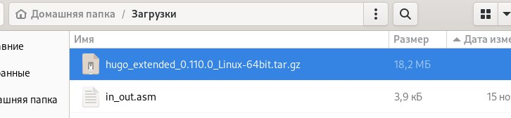{ #fig:001 width=40% }

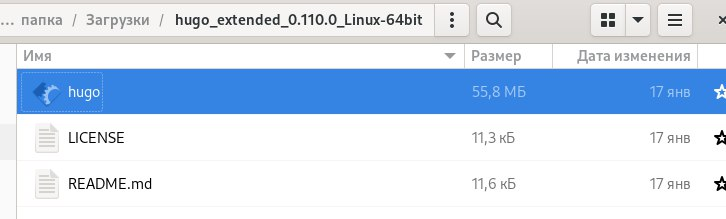{ #fig:002 width=40% }

## В домашней папке создадим папку bin и скопируем файл hugo в нее.

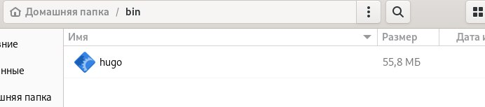{ #fig:003 width=70% }

## Создаем новый репозиторий под названием blog, а затем клонируем нужный шаблон.

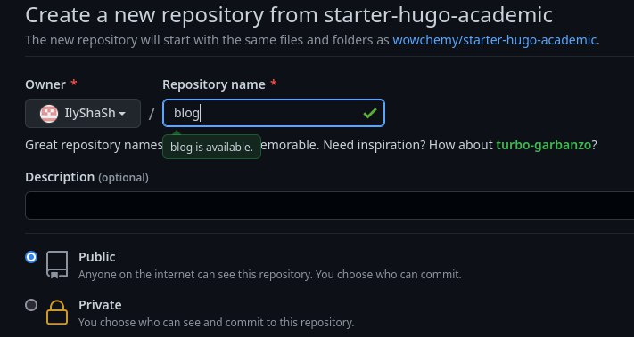{ #fig:004 width=70% }

##

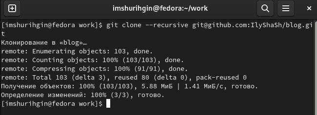{ #fig:005 width=70% }

## Переходим в каталог blog и выполняем команду ~/bin/hugo.

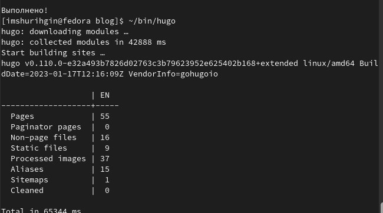{ #fig:006 width=70% }

## Выполним команду ~/bin/hugo server. Она выдаст нам ссылку на нащ локальный сайт. Его не видно с других устройств.

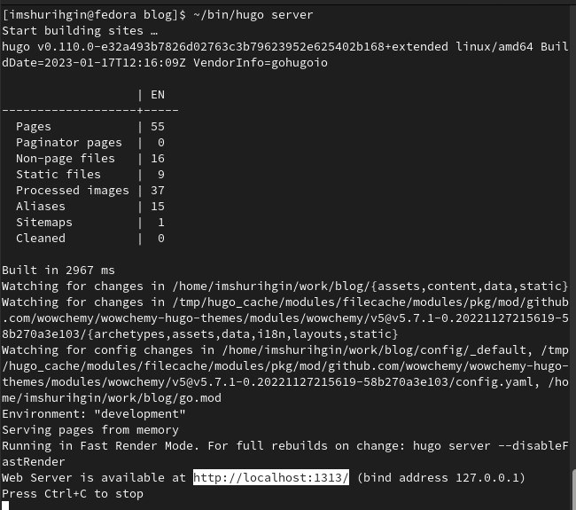{ #fig:007 width=50% }

##

{ #fig:008 width=70% }

## Теперь перенесем наш сайт на репозиторий. Так любой пользователь сможет получать к нему доступ.

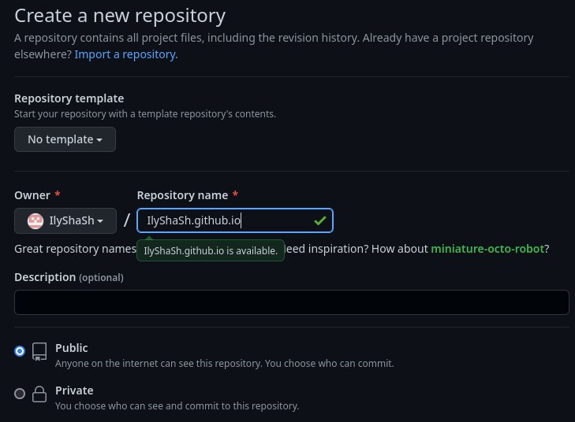{ #fig:009 width=70% }

## Клонируем репозиторий, создастся каталог с названием IlyShaSh.github.io

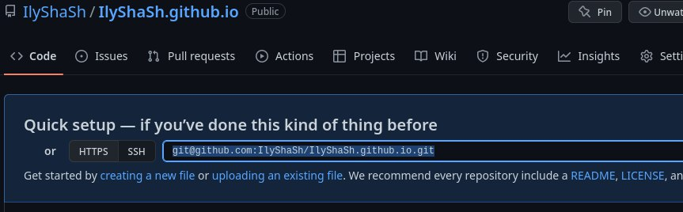{ #fig:010 width=70% }

##

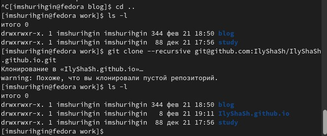{ #fig:011 width=70% }

## Создаем ветку main для нашего репозитория. После этого создаем пустой файл README.md

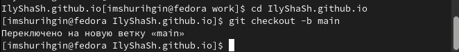{ #fig:012 width=70% }

##

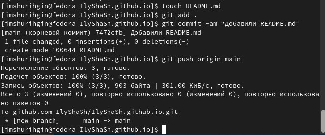{ #fig:013 width=40% }

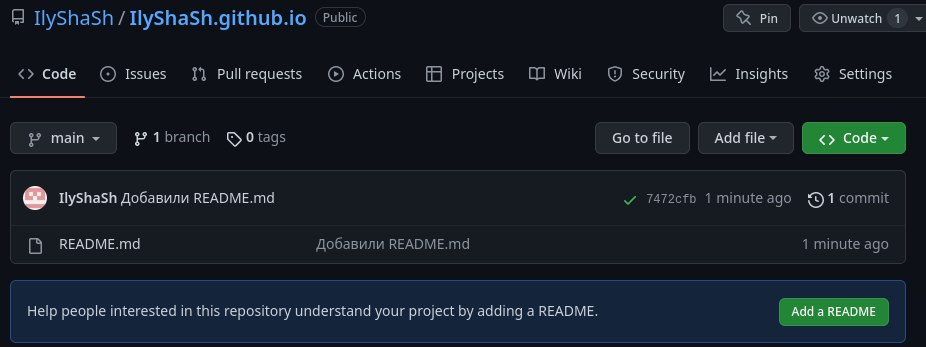{ #fig:014 width=40% }

## Подключим наш репозиторий к папке public внутри нашего блога. Исправим файл gitignore, чтобы не игнорировались каталоги public.

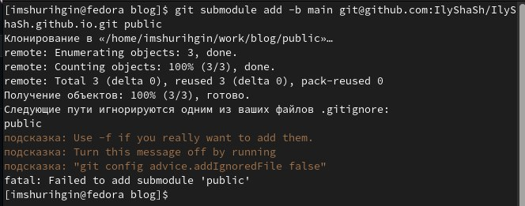{ #fig:015 width=40% }

##

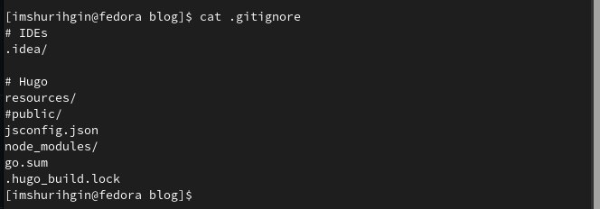{ #fig:017 width=70% }

## Теперь все, что мы добавим в public будет оказываться в нашем репозитории. Сгенерируем файлы сайта в public.

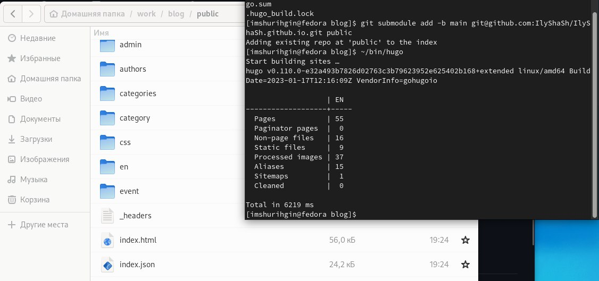{ #fig:018 width=70% }

## Теперь синхронизируем эти файлы с репозиторием.

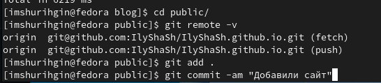{ #fig:019 width=40% }

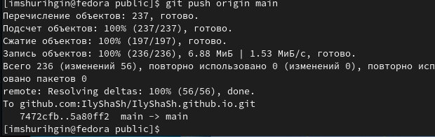{ #fig:020 width=40% }

## Проверяем что сайт работает.

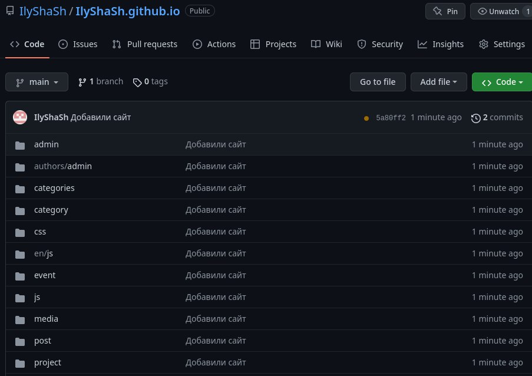{ #fig:021 width=40% }

{ #fig:022 width=40% }

## Выводы

Вывод: я создал новый репозитория для индивидуального проекта, с помощью которого я могу открывать собственный сайт с любого устройства.

# Результаты

## Заключение

Был получен навык создания собственного сайта Hugo. Цель работы была достигнута.