---
## Front matter
title: "ОТЧЕТ 
ПО ИНДИВИДУАЛЬНОМУ ПРОЕКТУ"
subtitle: "ЭТАП №1"
author: "Шурыгин Илья Максимович"

## Generic otions
lang: ru-RU
toc-title: "Содержание"

## Bibliography
bibliography: bib/cite.bib
csl: pandoc/csl/gost-r-7-0-5-2008-numeric.csl

## Pdf output format
toc: true # Table of contents
toc-depth: 2
lof: true # List of figures
lot: true # List of tables
fontsize: 12pt
linestretch: 1.5
papersize: a4
documentclass: scrreprt
## I18n polyglossia
polyglossia-lang:
  name: russian
  options:
	- spelling=modern
	- babelshorthands=true
polyglossia-otherlangs:
  name: english
## I18n babel
babel-lang: russian
babel-otherlangs: english
## Fonts
mainfont: PT Serif
romanfont: PT Serif
sansfont: PT Sans
monofont: PT Mono
mainfontoptions: Ligatures=TeX
romanfontoptions: Ligatures=TeX
sansfontoptions: Ligatures=TeX,Scale=MatchLowercase
monofontoptions: Scale=MatchLowercase,Scale=0.9
## Biblatex
biblatex: true
biblio-style: "gost-numeric"
biblatexoptions:
  - parentracker=true
  - backend=biber
  - hyperref=auto
  - language=auto
  - autolang=other*
  - citestyle=gost-numeric
## Pandoc-crossref LaTeX customization
figureTitle: "Рис."
tableTitle: "Таблица"
listingTitle: "Листинг"
lofTitle: "Список иллюстраций"
lotTitle: "Список таблиц"
lolTitle: "Листинги"
## Misc options
indent: true
header-includes:
  - \usepackage{indentfirst}
  - \usepackage{float} # keep figures where there are in the text
  - \floatplacement{figure}{H} # keep figures where there are in the text
---

# Цель работы

Целью моей работы является: создать сайт на Hugo. На данном этапе я хочу создать репозиторий будущего сайта, который может выступать в качестве хостинга.

# Задание

Необходимо создать новый репозиторий под проект и убедиться, что сайт открывается по ссылке моего аккаунта гитхаб.

# Выполнение индивидуального проекта

1. Скачиваем архив проекта и распаковываем его.(рис. [-@fig:001])(рис. [-@fig:002])

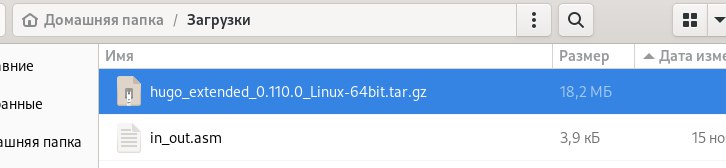{ #fig:001 width=70% }

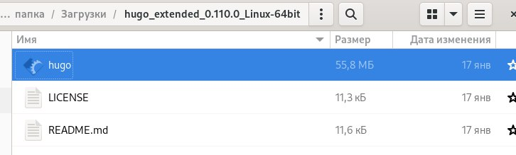{ #fig:002 width=70% }

2. В домашней папке создадим папку bin и скопируем файл hugo в нее.(рис. [-@fig:003])

{ #fig:003 width=70% }

3. Создаем новый репозиторий под названием blog, а затем клонируем нужный шаблон.(рис. [-@fig:004])(рис. [-@fig:005])

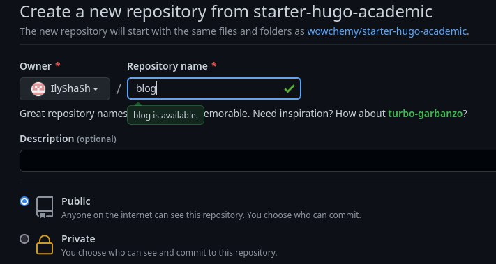{ #fig:004 width=70% }

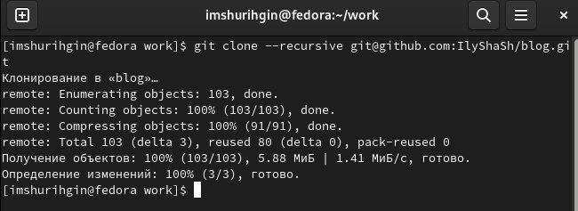{ #fig:005 width=70% }

4. Переходим в каталог blog и выполняем команду ~/bin/hugo.(рис. [-@fig:006])

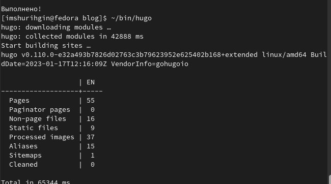{ #fig:006 width=70% }

5. Выполним команду ~/bin/hugo server. Она выдаст нам ссылку на нащ локальный сайт. Его не видно с других устройств.(рис. [-@fig:007])(рис. [-@fig:008])

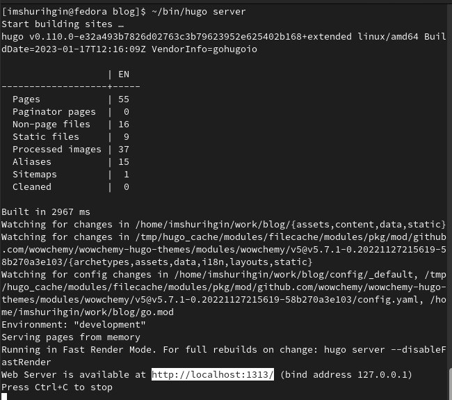{ #fig:007 width=70% }

{ #fig:008 width=70% }

6. Теперь перенесем наш сайт на репозиторий. Так любой пользователь сможет получать к нему доступ.(рис. [-@fig:009])

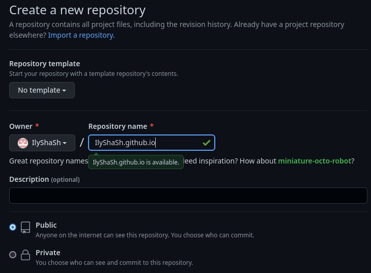{ #fig:009 width=70% }

7. Клонируем репозиторий, создастся каталог с названием IlyShaSh.github.io (рис. [-@fig:010])(рис. [-@fig:011])

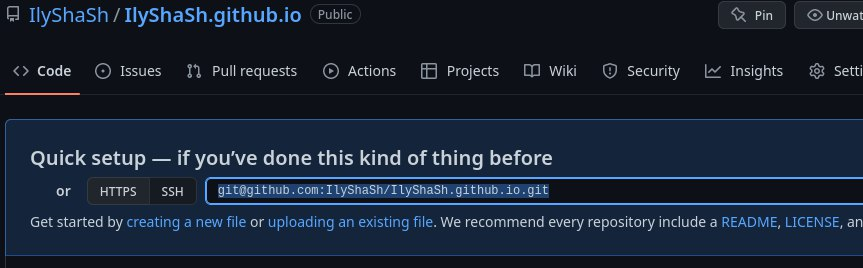{ #fig:010 width=70% }

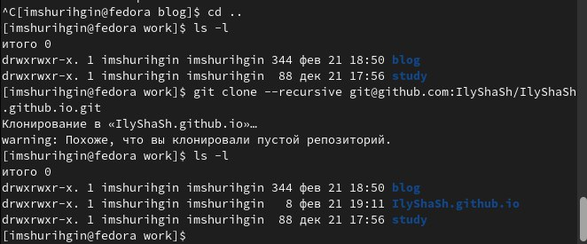{ #fig:011 width=70% }

8. Создаем ветку main для нашего репозитория. После этого создаем пустой файл README.md(рис. [-@fig:012])(рис. [-@fig:013])(рис. [-@fig:014])

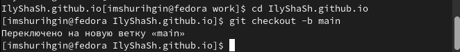{ #fig:012 width=70% }

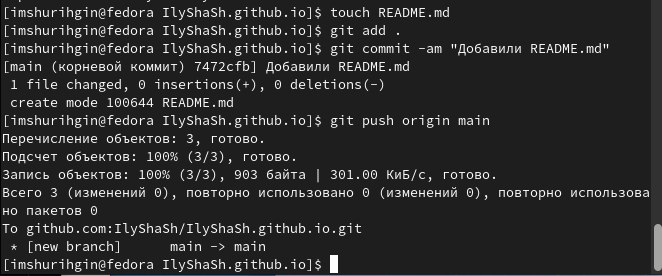{ #fig:013 width=70% }

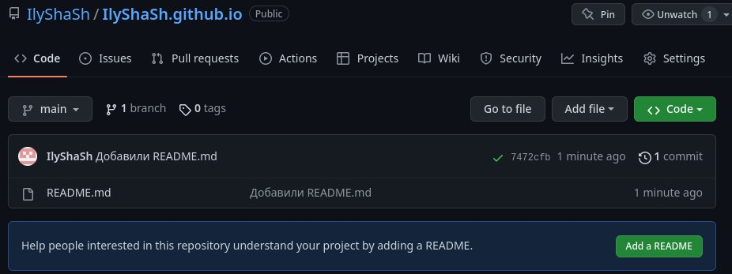{ #fig:014 width=70% }

9. Подключим наш репозиторий к папке public внутри нашего блога. Исправим файл gitignore, чтобы не игнорировались каталоги public.(рис. [-@fig:015])(рис. [-@fig:017])

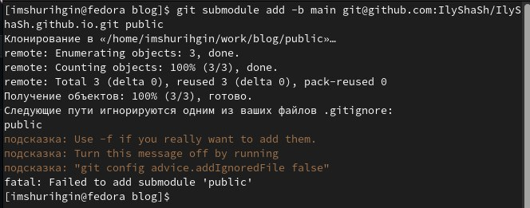{ #fig:015 width=70% }

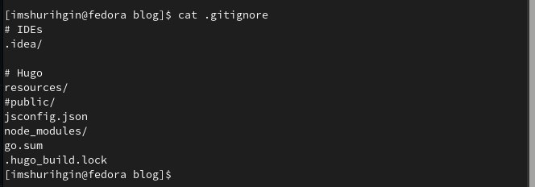{ #fig:017 width=70% }

10.  Теперь все, что мы добавим в public будет оказываться в нашем репозитории. Сгенерируем файлы сайта в public.(рис. [-@fig:018])

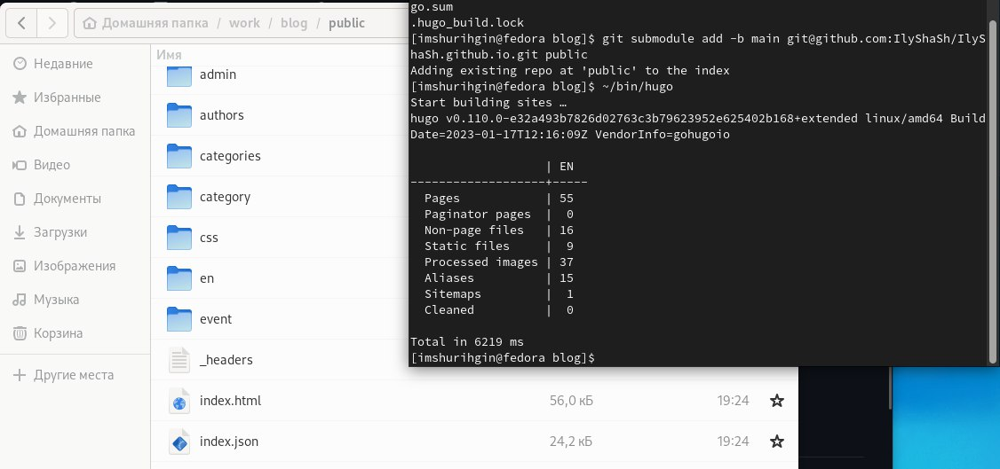{ #fig:018 width=70% }

11.  Теперь синхронизируем эти файлы с репозиторием.(рис. [-@fig:019])(рис. [-@fig:020])

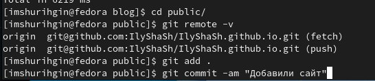{ #fig:019 width=70% }

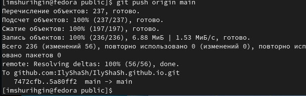{ #fig:020 width=70% }

12.  Проверяем что сайт работает.(рис. [-@fig:021])(рис. [-@fig:022])

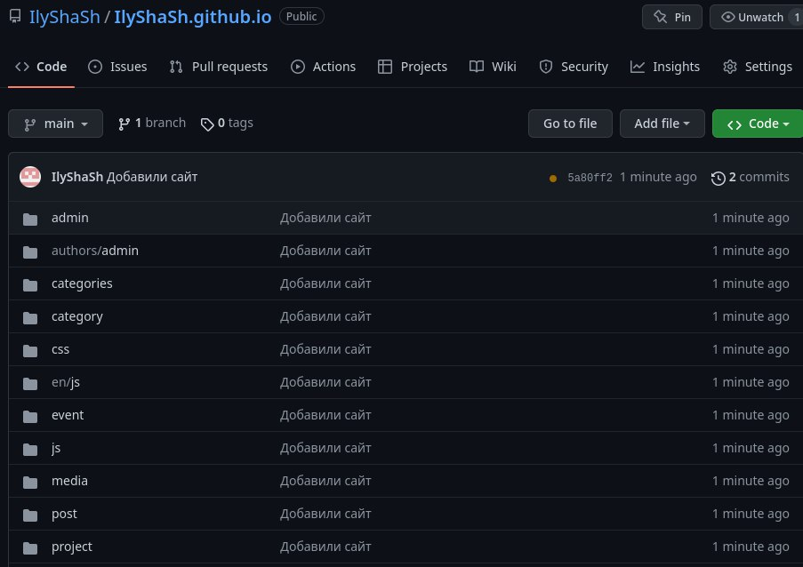{ #fig:021 width=70% }

{ #fig:022 width=70% }

# Выводы

Вывод: я создал новый репозитория для индивидуального проекта, с помощью которого я могу открывать собственный сайт с любого устройства.
