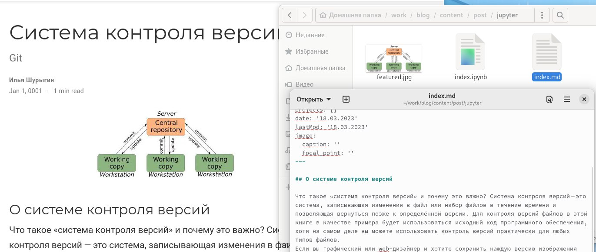
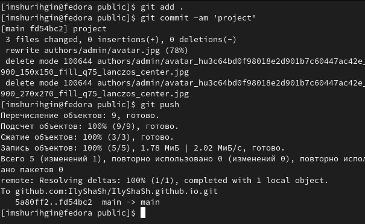

---
## Front matter
lang: ru-RU
title: ИНДИВИДУАЛЬНЫЙ ПРОЕКТ
subtitle: ЭТАП №2
author:
  - Шурыгин Илья
institute:
  - Российский университет дружбы народов, Москва, Россия
date: 17 февраля 2023

## i18n babel
babel-lang: russian
babel-otherlangs: english

## Formatting pdf
toc: false
toc-title: Содержание
slide_level: 2
aspectratio: 169
section-titles: true
theme: metropolis
header-includes:
  - \metroset{progressbar=frametitle,sectionpage=progressbar,numbering=fraction}
  - '\makeatletter'
  - '\beamer@ignorenonframefalse'
  - '\makeatother'
---

# Информация

## Докладчик

:::::::::::::: {.columns align=center}
::: {.column width="70%"}

- Шурыгин Илья Максимович
- студент-первокурсник
- Российский университет дружбы народов
- <https://github.com/IlyShaSh>

:::
::::::::::::::

# Вводная часть

## Цели и задачи

Целью моей работы является: заполнить сайт на Hugo. На данном этапе я хочу написать пост и заполнить поле про себя.

# Выполнение индивидуального проекта

## Для размещения фотографии заходим в “authors” -> “admin” и добавляем фотографию.

{ #fig:001 width=70% }

## Добавим краткое описание владельца сайта, информацию о интересах, образовании.

{ #fig:002 width=70% }

## Далее добавим пост недели и пост по выбору. Переходим в папку “contents” -> “post” и добавляем необходимую информацию.

{ #fig:003 width=40% }

{ #fig:004 width=40% }

## Выгружаем всё на сайт, используя знакомые команды и не забываем делать это и из “public”.

{ #fig:005 width=70% }

# Результаты

## Заключение

я создал новые посты на своем сайте, загрузил информацию о себе.
